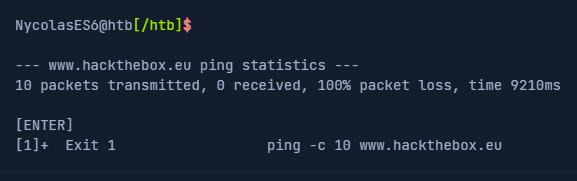

# Gestão de serviços e processos

Em geral, existem dois tipos de serviços: internos, os serviços relevantes que são necessários na inicialização do sistema, que, por exemplo, executam tarefas relacionadas ao hardware, e serviços que são instalados pelo usuário, que geralmente incluem todos os serviços do servidor. Esses serviços são executados em segundo plano, sem qualquer interação do usuário.

Eles também são chamados `daemons` e são identificados pela letra `d` no final do nome do programa, por exemplo, **sshd** ou **systemd** .

A maioria das distribuições agora mudou para `systemd`. Este é `Init process` iiciado primeiroe, portanto, possui o ID do processo (PID) 1. Este daemon monitora e cuida da inicialização e parada ordenada de outros serviços. Todos os processos possuem um PID atribuido que pode ser visualizado **/proc/** com o número correspondente. Esse processo pode ter um ID de processo pai (PPID) e, nesse caso, é conhecido como processo filho.

Além disso, systemctl também pode usar update-rc.d para gerenciar links de script de inicialização SysV. Vejamos alguns exemplos. Usaremos o servidor OpenSSH neste exemplos. Se não o tivermos instalado, instale-o antes de prosseguir para esta seção.

## Systemctl

Após a instalação OpenSSH em nossa VM, podemos iniciar o serviço com o seguinte comando.

`systemctl start ssh`

Depois de iniciarmos o serviço, podemos verificar se ele funciona sem erros.

`systemctl status ssh`

Para adicionar OpenSSH ao script SysV para informar ao sistema para executar este serviço após a inicialização, podemos vinculá-lo com o seguinte comando:

`systemctl enable ssh`

Assim que reiniciarmos o sistema, o servidor OpenSSH será executado automaticamente. Podemos verificar isso com uma ferramenta chamada ps.

`ps -aux | grep ssh`

Também podemos usar **systemctl** para listar todos os serviços.

`systemctl list-units --type=service`

é bem possível que os serviços não iniciem devido a algum erro. Para ver o problema, podemos usar a ferramenta journalctl para visualizar os logs.

`journalctl -u ssh.service --no-pager`

## Mate um processo

Um processo pode estar nos seguintes estados:

 - Running
 - Waiting (Esperando por um evento ou rcurso do sistema)
 - Stopped
 - Zombie (Parado mas ainda possui uma entrada na tabela de processos)

Os processos podem ser controlados usando kill, pkill, pgrep e killall. Para interagir com um processo, devemos enviar um sinal para ele. Podemos visualizar todos os sinais com o seguinte comand:

`kill -l`

Os mais comumente usados são:

1. `SIGHUP` - É enviado a um processo quando o terminal que o controla é fechado.
 - 2 - `SIGINT` - Enviado quando um usuário pressiona [Ctrl] + C o terminal de controle para interromper um processo.
 - 3 - `SIGQUIT` - Enviado quando um usuário pressiona [Ctrl] + D para sair.
 - 9 - `SIGKILL` - Elimine imediatamente um processo sem operações de limpeza.
 - 15 - `SIGTERM` - Encerramento do programa.
 - 19 - `SIGSTOP` - Pare o programa. Isso não pode mais ser tratado.
 - 20 - `SIGTSTP` - Enviado quando um usuário pressiona [Ctrl] + Z para solicitar a suspensão de um serviço. O usuário pode lidar com isso depois.

Por exemplo, se um programa travasse, poderíamos forçá-lo a encerrá-lo com o seguinte comando:

`kill 9 <PID>`

## Antecedentes de um processo

Ás vezes será necessário colocar em segundo plano a varredura ou prcesso que acabamos de iniciar para continuar usando a sessão atual para interagir com o sistema ou iniciar outros processos. Como já vimos, podemos fazer isso com o atalho [CTRL + Z] CTR. Conforme mencionado acima, enviamos o sinal SIGTSTP ao kernel, que suspende o processo.

`ping -c 10 ww.hackthebox.eu`

`vim tmpfile`

Agora todos os processos em segundo plano podem ser exibidos com o seguinte comando.

`jobs`

O atalho [CTRL + Z] suspende os processos e eles não serão mais executados. Para mantê-lo rodando em segundo plano, temos que inserir o comando `bg` para colocar o processo em segundo plano.

`bg`

Outra opção é definir automaticamente o processo com um sinal AND (&) no final do comando.

`ping -c 10 www.hackthebox.eu &`

Assim que o processo terminar, veremos os resultados:

## Colocar um processo em segundo plano

Depois disso, podemos usar o comando `jobs` para listar todos os processo em segundo plano. Os processos em segundo plano não requerem interação do usuário e podemos usar a mesma sessão do shell sem esperar até que o processo termine primeiro. Assim que a varredura ou processo terminar seu trabalho, seremos notificados pelo terminal de que o processo foifinalizado.

`$ jobs`

Se quisermos colocar o processo em segundo plano em primeiro plano e interagir com lele novamente, podemos usar o comando `$ fg <ID>`

`$ fg 1`

## Execute vários comandos

Existem três possibilidades para executar vários comandos, um após o outro. Eles são separados por:

 - Ponto e vírgula (;)
 - Caracteres duplos **ampersand** (&&)
 - Tubos (|)

A diferença entre eles está no tratamento dos processos anteriores e depende se o processo anterior foi concluido com sucesso ou com erros. O ponto e vírgula (;) é um separador de comandos e executa os comandos ignorando os resuktados e erros dos comandos anteriores.

`$ echo '1'; echo '2'; echo '3'`

Por exemplo, se executarmos o mesmo comando, mas substituí-lo em segundo lugar, o comando lspor um arquivo que não existe, obteremos um erro e o terceiro comando será executado mesmo assim.

`$ echo '1'; ls MISSING_FILE; echo '3'`

No entanto, parece diferente se usarmos os caracteres AND duplos ( &&) para executar os comandos um após o outro. Caso haja erro em um dos comandos, os seguintes não serão mais executados e todo o processo será interrompido.

Pipes ( |) dependem não apenas da operação correta e livre de erros dos processos anteriores, mas também dos resultados dos processos anteriores.

