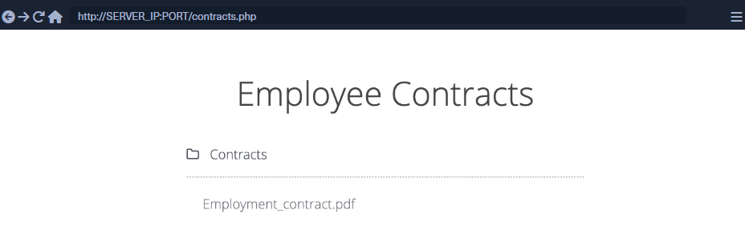
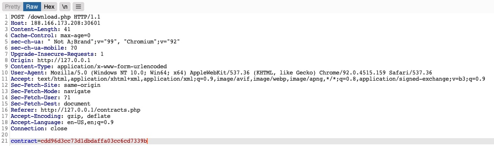

# Ignorando referencias codificadas

Vamos voltar ao Employee Manageraplicativo web para testar a Contractsfuncionalidade:



Se clicarmos no arquivo `Employment_contract.pdf`, ele inicia o download do arquivo. A solicitação interceptada no Burp é a seguinte:



Vemos que ele está enviando uma solicitação ``POST`` para ``download.php`` com os seguintes dados:

```php
contract=cdd96d3cc73d1dbdaffa03cc6cd7339b
```

Usar o script ``download.php`` para baixar arquivos é uma prática comum para evitar links diretos a arquivos, pois isso pode ser explorado por vários ataques na web. Nesse caso, o aplicativo da web não está enviando a referência direta em texto não criptografado, mas parece estar fazendo hash em um formato `md5`. Hashes são funções unilaterais, portanto não podemos decodificá-los para ver seus valores originais.

Podemos tentar fazer hash de vários valores, como uid, username, filename e muitos outros, e ver se algum de seus md5hashes corresponde ao valor acima. Se encontrarmos uma correspondência, poderemos replicá-la para outros usuários e coletar seus arquivos. Por exemplo, vamos tentar comparar o hash `md5` do nosso `uid` e ver se ele corresponde ao hash acima:

```bash
NycolasES6@htb[/htb]$ echo -n 1 | md5sum
```

Infelizmente, os hashes não correspondem. Podemos tentar fazer isso com vários outros campos, mas nenhum deles corresponde ao nosso hash. Em casos avançados, também podemos utilizar Burp Comparer e confundir vários valores e então comparar cada um com nosso hash para ver se encontramos alguma correspondência. Neste caso, o hash md5 poderia ser para um valor único ou uma combinação de valores, o que seria muito difícil de prever, tornando esta referência direta um Secure Direct Object Reference. No entanto, há uma falha fatal neste aplicativo web.

## Divulgação de Função

Como a maioria dos aplicativos web modernos são desenvolvidos usando estruturas JavaScript, como ``Angular``, ``React`` ou ``Vue.js``, muitos desenvolvedores web podem cometer o erro de executar funções confidenciais no front-end, o que os exporia a invasores. Por exemplo, se o hash acima estava sendo calculado no front-end, podemos estudar a função e então replicar o que ela está fazendo para calcular o mesmo hash. Felizmente para nós, este é precisamente o caso desta aplicação web.

Se dermos uma olhada no link no código-fonte, veremos que ele está chamando uma função JavaScript com ``javascript:downloadContract('1')``. Observando a função ``downloadContract()`` no código-fonte, vemos o seguinte:

```javascript
function downloadContract(uid) {
    $.redirect("/download.php", {
        contract: CryptoJS.MD5(btoa(uid)).toString(),
    }, "POST", "_self");
}
```

Esta função parece estar enviando uma solicitação ``POST`` com o parâmetro de ``contract``, que foi o que vimos acima. O valor que ele está enviando é um hash ``md5`` usando a biblioteca ``CryptoJS``, que também corresponde à solicitação que vimos anteriormente. Portanto, a única coisa que resta ver é qual valor está sendo hash.

Nesse caso, o valor que está sendo hash é ``btoa(uid)``, que é a string codificada em ``base64`` da variável ``uid``, que é um argumento de entrada para a função. Voltando ao link anterior onde a função foi chamada, vemos ela chamando ``downloadContract('1')``. Portanto, o valor final usado na solicitação ``POST`` é a string codificada em ``base64`` de ``1``, que foi então com hash ``md5``.

Podemos testar isso codificando nosso ``uid = 1`` em ``base64`` e, em seguida, fazendo hash com ``md5``, como segue:

```bash
NycolasES6@htb[/htb]$ echo -n 1 | base64 -w 0 | md5sum
```

>Dica: Estamos usando o sinalizador ``-n`` com ``echo``, e o sinalizador ``-w 0`` com ``base64``, para evitar a adição de novas linhas, para poder calcular o hash md5 do mesmo valor, sem hash de novas linhas, pois isso alteraria o hash ``md5`` final.

Como podemos ver, este hash corresponde ao hash da nossa solicitação, o que significa que revertemos com sucesso a técnica de hashing usada nas referências de objetos, transformando-as em IDOR's. Com isso, podemos começar a enumerar os contratos de outros funcionários usando o mesmo método de hash que usamos acima. Antes de continuar, tente escrever um script semelhante ao que usamos na seção anterior para enumerar todos os contratos.

## Enumeração em massa

Mais uma vez, vamos escrever um script bash simples para recuperar todos os contratos de funcionários. Na maioria das vezes, este é o método mais fácil e eficiente de enumerar dados e arquivos através de vulnerabilidades IDOR. Em casos mais avançados, podemos utilizar ferramentas como ``Burp Intruder`` ou ``ZAP Fuzzer``, mas um simples script bash deve ser o melhor caminho para o nosso exercício.

Podemos começar calculando o hash para cada um dos dez primeiros funcionários usando o mesmo comando anterior enquanto usamos ``tr -d`` para remover os caracteres ``-`` finais, como segue:

```bash
NycolasES6@htb[/htb]$ for i in {1..10}; do echo -n $i | base64 -w 0 | md5sum | tr -d ' -'; done
```

A seguir, podemos fazer uma solicitação ``POST`` em ``download.php`` com cada um dos hashes acima como valor do ``contract``, o que deve nos fornecer nosso script final:

```bash
#!/bin/bash

for i in {1..10}; do
    for hash in $(echo -n $i | base64 -w 0 | md5sum | tr -d ' -'); do
        curl -sOJ -X POST -d "contract=$hash" http://SERVER_IP:PORT/download.php
    done
done
```

Com isso, podemos executar o script, e ele deverá baixar todos os contratos dos funcionários de 1 a 10:

```bash
NycolasES6@htb[/htb]$ bash ./exploit.sh
NycolasES6@htb[/htb]$ ls -1
```

Como podemos ver, como pudemos reverter a técnica de hashing usada nas referências de objetos, agora podemos explorar com sucesso a vulnerabilidade IDOR para recuperar todos os contratos de outros usuários.
