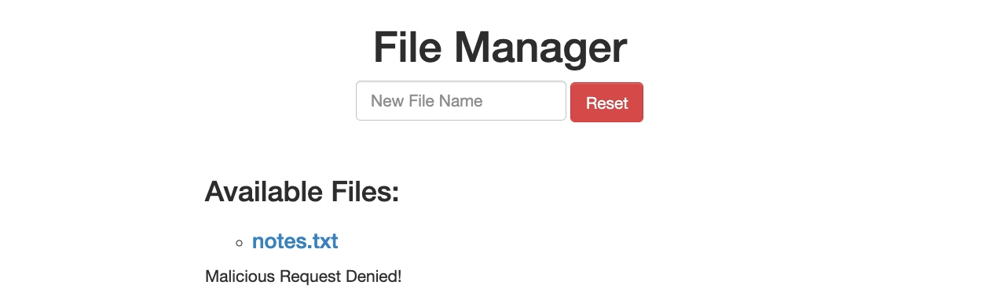
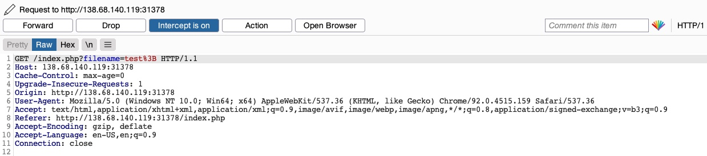
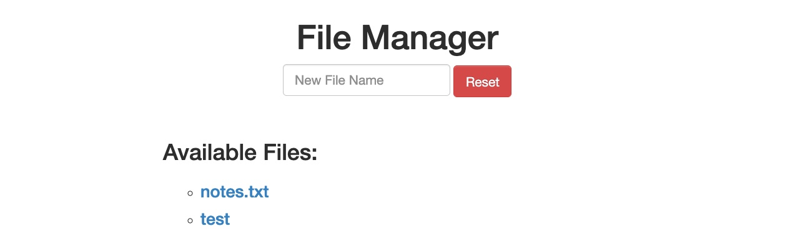
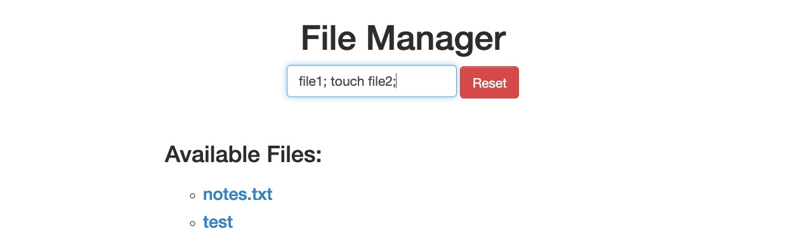
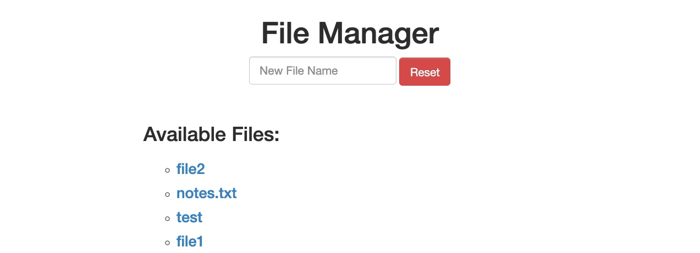

# Ignorando filtros de segurança

O outro tipo mais comum de vulnerabilidade de adulteração de verbo HTTP é causado por `Insecure Coding`, erros cometidos durante o desenvolvimento da aplicação web, que fazem com que a aplicação web não cubra todos os métodos HTTP em determinadas funcionalidades. Isso é comumente encontrado em filtros de segurança que detectam solicitações maliciosas. Por exemplo, se um filtro de segurança estava sendo usado para detectar vulnerabilidades de injeção e apenas verificava injeções em parâmetros `POST` (por exemplo, `$_POST['parameter']`), pode ser possível contorná-lo simplesmente alterando o método de solicitação para GET.

## Identificar

Na aplicação web `File Manager`, se tentarmos criar um novo nome de arquivo com caracteres especiais em seu nome (por exemplo, `test;`), receberemos a seguinte mensagem:

Esta mensagem mostra que o aplicativo da web usa determinados filtros no back-end para identificar tentativas de injeção e, em seguida, bloqueia quaisquer solicitações maliciosas. Não importa o que tentemos, o aplicativo da web bloqueia adequadamente nossas solicitações e está protegido contra tentativas de injeção. No entanto, podemos tentar um ataque de adulteração de verbo HTTP para ver se conseguimos contornar completamente o filtro de segurança.

## Explorar

Para tentar explorar esta vulnerabilidade, vamos interceptar a solicitação no Burp Suite (Burp) e depois usamos `Change Request Method` para alterá-la para outro método:

Desta vez, não recebemos a Malicious Request Denied!mensagem e nosso arquivo foi criado com sucesso:

Para confirmar se contornamos o filtro de segurança, precisamos tentar explorar a vulnerabilidade que o filtro está protegendo: uma vulnerabilidade de injeção de comando, neste caso. Assim, podemos injetar um comando que crie dois arquivos e depois verificar se ambos os arquivos foram criados. Para fazer isso, usaremos o seguinte nome de arquivo em nosso ataque ( `file1; touch file2;`):

Então, podemos mais uma vez alterar o método de solicitação para uma  solicitação `GET`:

Assim que enviarmos nossa solicitação, vemos que desta vez file1 e file2 foram criados:

Isso mostra que contornamos o filtro com sucesso por meio de uma vulnerabilidade de adulteração de verbo HTTP e conseguimos injeção de comando. Sem a vulnerabilidade de adulteração de verbo HTTP, o aplicativo da web poderia estar seguro contra ataques de injeção de comando, e essa vulnerabilidade nos permitiu ignorar completamente os filtros em vigor.
