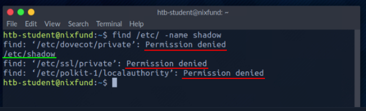
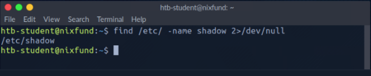
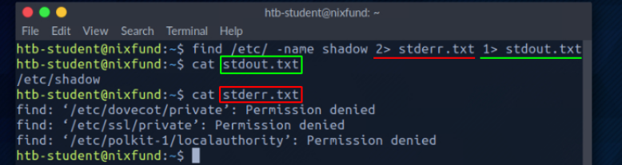
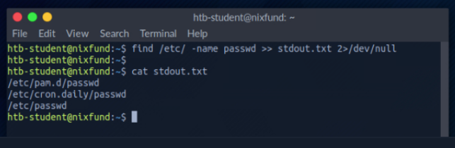
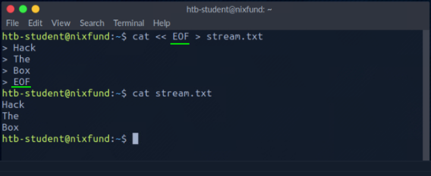
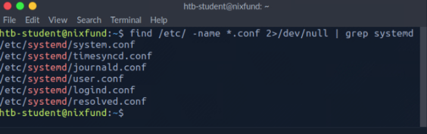

# Descritores e redirecionamentos de arquivos

Um descritor de arquivo (FD) em sistemas operacionais Unix/Linux é um indicador de conexão mantida pelo kernel para executar operações de entrada/saída (E/S). Em sistemas operacionais baseados em Windows, é chamado de filehandle. É a conexão (geralmente a um arquivo) do sistema operacional para realizar operações de E/S (Entrada/Saída de Bytes). Por padrão, os três primeiros descritores de arquivo no Linux são:

1. Fluxo de dados para entrada
    - ``STDIN – 0``
. Fluxo de dados para saída
    - ``STDOUT – 1``
3. Fluxo de dados para saída relacionado à ocorrência de um erro.
    - ``STDERR – 2``

## STDIN e STDOUT

Vejamos um exemplo com **cat**. Ao executar **cat**, damos ao programa em execução nossa entrada padrão ( STDIN - FD 0), marcada **green**, onde neste caso é "SOME INPUT". Assim que tivermos confirmado nossa entrada com **[ENTER]**, ela será retornada ao terminal como saída padrão ( **STDOUT - FD 1**), marcada em vermelho .

## STDOUT e STDERR

No próximo exemplo, usando o comando **find**, veremos a saída padrão ( **STDOUT - FD 1**) marcada verde e o erro padrão ( **STDERR - FD 2**) marcado em vermelho.

``NycolasES6@htb[/htb]$ find /etc/ -name shadow``

Neste caso, o erro é marcado e exibido com " **Permission denied**". Podemos verificar isso redirecionando o descritor de arquivo dos erros ( **FD 2 - STDERR**) para " **/dev/null**." Dessa forma, redirecionamos os erros resultantes para o “dispositivo nulo”, que descarta todos os dados.

``NycolasES6@htb[/htb]$ find /etc/ -name shadow 2>/dev/null``

## Redirecionar STDOUT para um arquivo

Agora podemos ver que todos os erros (**STDERR**) apresentados anteriormente com "**Permission denied**" não são mais exibidos. O único resultado que vemos agora é a saída padrão (**STDOUT**), que também podemos redirecionar para um arquivo com o nome results.txtque conterá apenas a saída padrão sem os erros padrão.

``NycolasES6@htb[/htb]$ find /etc/ -name shadow 2>/dev/null > results.txt``

## Redirecionar STDOUT e STDERR para arquivos separados

Deveríamos ter notado que não usamos um número antes do sinal de maior que (**>**) no último exemplo. Isso ocorre porque redirecionamos todos os erros padrão para " **null device**" antes, e a única saída que obtemos é a saída padrão ( **FD 1 - STDOUT**). Para tornar isso mais preciso, redirecionaremos o erro padrão ( **FD 2 - STDERR**) e a saída padrão ( **FD 1 - STDOUT**) para arquivos diferentes.

``NycolasES6@htb[/htb]$ find /etc/ -name shadow 2> stderr.txt 1> stdout.txt``

## Redirecionar STDIN

Como já vimos, em combinação com os descritores de arquivo, podemos redirecionar erros e gerar saída com caractere maior que ( **>** ). Isso também funciona com o sinal de menor que (`<`). No entanto, o sinal inferior serve como entrada padrão ( **FD 0 - STDIN**). Esses caracteres podem ser vistos como " **direction**" na forma de uma seta que nos indica " **from where**" e " **where to**" que os dados devem ser redirecionados. Usamos o comando **cat** para usar o conteúdo do arquivo " **stdout.txt**" como **STDIN**.

``NycolasES6@htb[/htb]$ cat < stdout.txt``

## Redirecionar STDOUT e anexar a um arquivo

Quando usamos o sinal de maior que (**>**) para redirecionar nosso arquivo **STDOUT**, um novo arquivo é criado automaticamente se ainda não existir. Se este arquivo existir, ele será sobrescrito sem solicitação de confirmação. Se quisermos anexar **STDOUT** ao nosso arquivo existente, podemos usar o sinal duplo maior que (**>>**).

``NycolasES6@htb[/htb]$ find /etc/ -name passwd >> stdout.txt 2>/dev/null``

## Redirecionar fluxo STDIN para um arquivo

Também podemos usar caracteres duplos inferiores (`<<`) para adicionar nossa entrada padrão por meio de um fluxo. Podemos usar a chamada função **End-Of-File(EOF)** de um arquivo de sistema Linux, que define o final da entrada. No próximo exemplo, usaremos o comando **cat** para ler nossa entrada de streaming através do stream e direcioná-la para um arquivo chamado "**stream.txt**".

``NycolasES6@htb[/htb]$ cat << EOF > stream.txt``

## Tubos

Outra forma de redirecionar **STDOUT** é usar pipes (**|**). Eles são úteis quando queremos usar STDOUT para um programa ser processado por outro. Uma das ferramentas mais utilizadas é o grep, que usaremos no próximo exemplo. Grep é usado para filtrar STDOUT  de acordo com o padrão que definimos. No próximoexemplo, usamos o comando find para procurar todos os arquivos no diretório /etc/ com a extensão ".conf". Eventuais erros são redirecionados para "null device" (/dev/null). Usando o grep, filtramos os resultados e especificamos que apenas as linhas que comtêm o padrão "systemd" devem ser exibidas.

``NycolasES6@htb[/htb]$ find /etc/ -name *.conf 2>/dev/null | grep systemd``

Os redirecionamentos funcionam, não apenas uma vez. Podemos usar os resultados obtidos para redirecioná-los para outro programa. Para o próximo exemplo, utilizaremos a ferramenta chamada wc, que deverá contar o número total de resultados obtidos.

``NycolasES6@htb[/htb]$ find /etc/ -name *.conf 2>/dev/null | grep systemd | wc -l``

