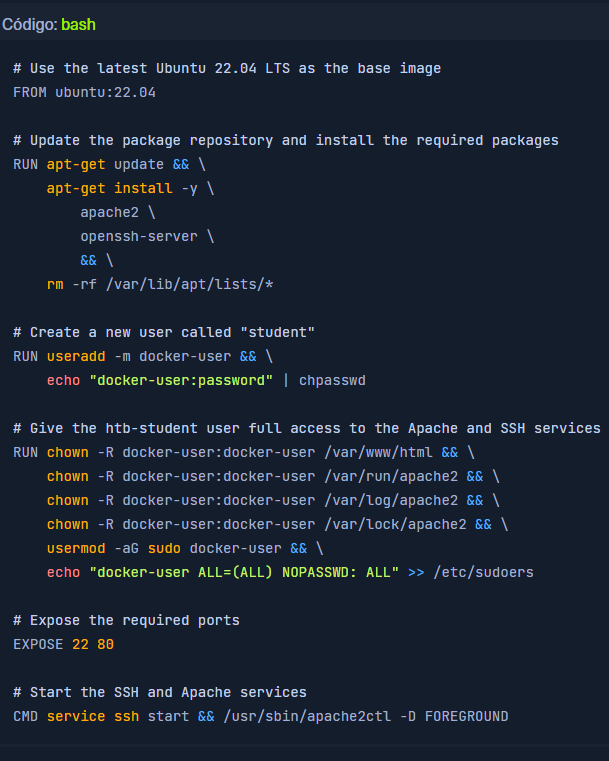

# Conteinerização

A conteinerização é um processo de empacotamento e execução de aplicativos em ambientes isolados, como um contêiner, uma máquina virtual ou um ambiente sem servidor. Tecnologias como Docker, Docker Compose e Linux Containers tornam esse processo possível em sistemas Linux. Essas tecnologias permitem que os usuários criem, implantem e gerenciem aplicativos de forma rápida, segura e eficiente. Com essas ferramentas, os usuários podem configurar seus aplicativos de diversas maneiras, permitindo-lhes adaptar o aplicativo às suas necessidades. Além disso, os contêineres são incrivelmente leves, perfeitos para executar vários aplicativos simultaneamente e fornecer escalabilidade e portabilidade. A conteinerização é uma ótima maneira de garantir que os aplicativos sejam gerenciados e implantados com eficiência e segurança.

A segurança dos contêineres é um aspecto importante da conteinerização. Eles fornecem aos usuários um ambiente seguro para executar seus aplicativos, uma vez que estão isolados do sistema host e de outros contêineres. Esse isolamento ajuda a proteger o sistema host de quaisquer atividades maliciosas no contêiner, ao mesmo tempo que fornece uma camada adicional de segurança para os aplicativos executados nos contêineres. Além disso, os contêineres têm a vantagem de serem leves, o que os torna mais difíceis de comprometer do que as máquinas virtuais tradicionais. Além disso, os contêineres são fáceis de configurar, o que os torna ideais para executar aplicativos com segurança.

Além de fornecer um ambiente seguro, os contêineres oferecem aos usuários muitas outras vantagens porque tornam os aplicativos mais fáceis de implantar e gerenciar e mais eficientes para executar vários aplicativos simultaneamente. No entanto, ainda existem métodos para aumentar nossos privilégios em contêineres e escapar deles.

## Docker

Docker é uma plataforma de código aberto para automatizar a implantação de aplicativos como unidades independentes chamadas contêineres. Ele usa um sistema de arquivos em camadas e recursos de isolamento de recursos para fornecer flexibilidade e portabilidade. Além disso, fornece um conjunto robusto de ferramentas para criar, omplantar e gerenciar aplicativos, o que ajuda a agilizaro processo de conteinerização.

## Instale o Docker Engine

Instalar o Docker é relativamente simples. Podemos usar o seguinte script para instalá-lo em um host Ubuntu:

Código **bash**

> #!/bin/bash
>
> \# Preparation
>
>sudo apt update -y
>
>sudo apt install ca-certificates curl gnupg lsb-release -y
>
>sudo mkdir -m 0755 -p /etc/apt/keyrings
>
>curl -fsSL https://download.docker.com/linux/ubuntu/gpg | sudo gpg --dearmor -o /etc/apt/keyrings/docker.gpg
>
>echo "deb [arch=$(dpkg --print-architecture) signed-by=/etc/apt/keyrings/docker.gpg] https://download.docker.com/linux/ubuntu $(lsb_release -cs) stable" | sudo tee /etc/apt/sources.list.d/docker.list > /dev/null
>
>
>\# Install Docker Engine
>
>sudo apt update -y
>
>sudo apt install docker-ce docker-ce-cli containerd.io docker-buildx-plugin docker-compose-plugin -y
>
>\# Add user htb-student to the Docker group
>
>sudo usermod -aG docker htb-student
>
>echo '[!] You need to log out and log back in for the group changes to take effect.'
>
>\# Test Docker installation
>
>docker run hello-world
>

O mecanismo Docker e imagens específicas do Docker são necessários para executar um contêiner. Estas podem ser obtidas no **Docker Hub** , um repositório de imagens pré-fabricadas, ou criadas pelo usuário. O Docker Hub é um registro baseado em nuvem para repositórios de software ou uma biblioteca para imagens Docker. Está dividido em uma área **publica** e uma **privada**. A área pública permite aos usuários fazer upload e compartilhar imagens com a comunidade. Ele também contém imagens oficiais da equipe de desenvolvimento do Docker e de projetos de código aberto estabelecidos. As imagens enviadas para uma área privada do registro não são acessíveis ao público. Eles podem ser compartilhados dentro de uma empresa ou com equipes e conhecidos.

A criação de uma imagem Docker é feita criando um **Dockerfile** , que contém todas as instruções que o mecanismo Docker precisa para criar o contêiner. Podemos usar contêineres Docker como nosso servidor de “hospedagem de arquivos” ao transferir arquivos específicos para nossos sistemas de destino. Portanto, devemos criar um sistema **Dockerfile** baseado em Ubuntu 22.04 com **Apache** e um servidor **SSH** rodando. Com isso, podemos usar **scp** para transferir arquivos para a imagem do docker, e o Apache nos permite hospedar arquivos e usar ferramentas como **curl**, **wget** e outras no sistema de destino para baixar os arquivos necessários. Isse **Dockerfile** poderia ser parecido com o seguinte:

Depois de definirmos nosso **Dockerfile**, precisamos convertê-lo em uma imagem. Como o comando **build**, pegamos o diretório com o Dockerfile, executamos os passos do Dockerfile e armazenamos a imagem em nosso Docker Engine local, Se uma das etapas falhar devido a um erro, a acriação do contêiner será abortada. Com a opção **-t**, atribuímos uma tag ao nosso contêiner, para que seja mais fácil identificá-lo e trabalhar posteriormente.

### Construção do Docker

`$ docker build -t FS_docker .`

Depois que a imagem Docker for criada, ela poderá ser executada por meio do mecanismo Docker, tornando-a uma maneira muito eficiente e fácil de executar um contêiner. É semelhante ao conceito de máquina virtual, baseado em imagens. Ainda assim, essas imagens são modelos somente leitura e fornecem o sistema de arquivos necessário para o tempo de execução e todos os parâmetros. Um contêiner pode ser considerado um processo em execução de uma imagem. Quando um contêiner deve ser iniciado em um sistema, um pacote com a respectiva imagem é carregado primeiro, caso não esteja disponível localmente. Podemos iniciar o contêiner com o seguinte comando docker run :

### Execução do Docker - Sintaxe

`$ docker run -p <host port>:<docker port> -d <docker container name>`

### Execução do Docker

`$ docker run -p 8022:22 -p 8080:80 -d FS_docker`

Nesse caso, iniciamos um novo contêiner a partir da imagem FS_dockere mapeamos as portas do host 8022 e 8080 para as portas do contêiner 22 e 80, respectivamente. O contêiner é executado em segundo plano, permitindo acessar os serviços SSH e HTTP dentro do contêiner usando as portas de host especificadas.

### Gerenciamento Docker

Ao gerenciar contêiners Docker, o Docker fornece um conjunto abrangente de ferramentas que nos permite criar, implantar e gerenciar os contêineres facilmente. Com essas ferramentas poderosas, podemos listar, iniciar e parar contêineres e gerenciálos de forma eficaz, garantindo a execução perfeita do aplicativos. Alguns dos comandos de gerenciamento do docker mais comumente usados são:

 - `docker ps` - Lista os contêineres em execução.
 - `docker ps -a` - Lista todos os contêineres.
 - `docker start` - Inicia um contêiner parado.
 - `docker restart` - Reinicia um contêiner em execução.
 - `docker stop` - Para um contêiner em execução.
 - `docker rm ` - Remove um recipiente.
 - `docker rmi ` - Remove uma imagem do docker.
 - `docker logs` - Veja os logs de um contêiner.

Vale ressaltar que esses comandos, utilizados no Docker, podem ser combinados com diversas opções para fornecer funcionalidades adicionais. Por exemplo, podemos especificar quais portas expor, montar volumes ou definir variáveis de ambiente. Isso nos permite personalizar nossos contêineres Docker para atender às nossas necessidades e exigências. Ao trabalhar com imagens Docker, é importante observar que quaisquer alterações feitas em uma imagem existente não são permanentes. Em vez disso, precisamos criar uma nova imagem que herde da original e inclua as alterações desejadas.

Isso é feito criando um novo Dockerfile que começa com a instrução **FROM**, que especifica a imagem base, e depois adiciona os comandos necessários para fazer as alterações desejadas. Depois que o Dockerfile for criado, podemos usar o comando **docker build** para construir a nova imagem, marcando-a com um nome exclusivo para ajudar a identificá-la. Este processo garante que a imagem original permaneça intacta ao mesmo tempo que nos permite criar uma nova imagem com as alterações desejadas.

É importante observar que os contêineres Docker são projetados para serem imutáveis, o que significa que quaisquer alterações feitas em um contêiner durante o tempo de execução serão perdidas quando o contêiner for interrompido. Portanto, é recomendado usar ferramentas de orquestração de contêineres, como Docker Compose ou Kubernetes, para gerenciar e dimensionar contêineres em um ambiente de produção.

## Contêineres Linux

Linux Containers ( **LXC** ) é uma tecnologia de virtualização que permite que vários sistemas Linux isolados sejam executados em um único host. Ele usa recursos de isolamento de recursos, como **cgroups** e **namespaces**, para fornecer uma solução de virtualização leve. O LXC também fornece um rico conjunto de ferramentas e APIs para gerenciar e configurar contêineres, contribuindo para sua popularidade como tecnologia de conteinerização. Ao combinar as vantagens do LXC com o poder do Docker, os usuários podem obter uma experiência completa de conteinerização em sistemas Linux.

Tanto o LXC quanto o Docker são tecnologias de conteinerização que permitem que aplicativos sejam empacotados e executados em ambientes isolados. No entanto, existem algumas diferenças entre os dois que podem ser distinguidas com base nas seguintes categorias:

 - Abordagem
 - Construção de imagem
 - Portabilidade
 - Fácil de usar
 - Segurança

LXC é uma tecnologia de virtualização leve que usa recursos de isolamento de recursos do kernel Linux para fornecer um ambiente isolado para aplicativos. No LXC, as imagens são construídas manualmente criando um sistema de arquivos raiz e instalando os pacotes e configurações necessários. Esses contêineres estão vinculados ao sistema host, podem não ser facilmente portáteis e podem exigir mais conhecimento técnico para serem configurados e gerenciados. O LXC também oferece alguns recursos de segurança, mas pode não ser tão robusto quanto o Docker.

Por outro lado, Docker é uma plataforma centrada em aplicativos que se baseia no LXC e fornece uma interface mais amigável para conteinerização. Suas imagens são construídas usando um Dockerfile, que especifica a imagem base e as etapas necessárias para construir a imagem. Essas imagens são projetadas para serem portáteis, para que possam ser facilmente movidas de um ambiente para outro. O Docker fornece uma interface mais amigável para conteinerização, com um rico conjunto de ferramentas e APIs para gerenciar e configurar contêineres com um ambiente mais seguro para a execução de aplicativos.

Para instalar o LXC em uma distribuição Linux, podemos usar o gerenciador de pacotes da distribuição. Por exemplo, no Ubuntu, podemos usar o gerenciador **apt** de pacotes para instalar o LXC com o seguinte comando:

### Instale o LXC

`$ sudo apt-get install lxc lxc-utils -y`

Depois que o LXC estiver instalado, podemos começar a criar e gerenciar contêineres no host Linux. É importante notar que o LXC requer que o kernel Linux suporte os recursos necessários para conteinerização. A maioria dos kernels Linux modernos tem suporte integrado para conteinerização, mas alguns kernels mais antigos podem exigir configuração ou patch adicional para habilitar o suporte para LXC.

### Criando um contêiner LXC

Para criar um novo contêiner LXC, podemos usar o comando lxc-create seguido do nome do contêiner e do modelo a ser usado. Por exemplo, para criar um novo contêiner Ubuntu chamado **linuxcontainer**, podemos usar o seguinte comando:

`$ sudo lxc-create -n linuxcontainer -t ubuntu`

### Gerenciando contêineres LXC

Ao trabalhar com contêineres LXC, diversas tarefas estão envolvidas no gerenciamento deles. Essas tarefas incluem criar novos contêineres, definir suas configurações, iniciá-los e interrompê-los conforme necessário e monitorar seu desempenho. Felizmente, existem muitas ferramentas de linha de comando e arquivos de configuração disponíveis que podem ajudar nessas tarefas. Estas ferramentas permitem-nos gerir rápida e facilmente os nossos contentores, garantindo que estão otimizados para as nossas necessidades e requisitos específicos. Ao aproveitar essas ferramentas de forma eficaz, podemos garantir que nossos contêineres LXC funcionem de forma eficiente e eficaz, permitindo-nos maximizar o desempenho e as capacidades do nosso sistema.

 - `lxc-ls` - Liste todos os contêineres existentes
 - `lxc-stop -n <container>` - Pare um contêiner em execução.
 - `lxc-start -n <container>` - Inicie um contêiner parado.
 - `lxc-restart -n <container>` - Reinicie um contêiner em execução.
 - `lxc-config -n <container name> -s storage` - Gerencie o armazenamento de contêineres
 - `lxc-config -n <container name> -s network` - Gerenciar configurações de rede de contêineres
 - `lxc-config -n <container name> -s security` - Gerenciar configurações de segurança de contêiner
 - `lxc-attach -n <container>` - Conecte-se a um contêiner.
 - `lxc-attach -n <container> -f /path/to/share` - Conecte-se a um contêiner e compartilhe um diretório ou arquivo específico.

Como testadores de penetração, podemos encontrar situações em que precisamos testar softwares ou sistemas com dependências ou configurações difíceis de reproduzir em nossas máquinas. É aqui que os contêineres Linux são úteis. Como um contêiner Linux é um pacote executável independente e leve que contém todas as dependências e arquivos de configuração necessários para executar um software ou sistema específico, ele fornece um ambiente isolado que pode ser executado em qualquer máquina Linux, independentemente da configuração do host.

Os contêineres são úteis, especialmente porque nos permitem criar rapidamente um ambiente isolado específico para nossas necessidades de teste. Por exemplo, podemos precisar testar uma aplicação web que requer um banco de dados específico ou uma versão de servidor web. Em vez de configurar esses componentes em nossa máquina, o que pode ser demorado e sujeito a erros, podemos criar um contêiner que contenha a configuração exata de que precisamos.

Também podemos usá-los para testar explorações ou malware em um ambiente controlado, onde criamos um contêiner que simula um sistema ou rede vulnerável e, em seguida, usamos esse contêiner para testar explorações com segurança, sem correr o risco de danificar nossas máquinas ou redes. No entanto, é importante configurar a segurança do contêiner LXC para evitar acesso não autorizado ou atividades maliciosas dentro do contêiner. Isto pode ser conseguido através da implementação de diversas medidas de segurança, tais como:

 - Restringindo o acesso ao contêiner
 - Limitando recursos
 - Isolando o contêiner do host
 - Aplicação de controle de acesso obrigatório
 - Manter o contêiner atualizado

Os contêineres LXC podem ser acessados usando vários métodos, como SSH ou console. Recomenda-se restringir o acesso ao contêiner desabilitando serviços desnecessários, usando protocolos seguros e aplicando mecanismos de autenticação fortes. Por exemplo, podemos desabilitar o acesso SSH ao contêiner removendo o pacote **openssh-server** ou configurando o SSH apenas para permitir o acesso de endereços IP confiáveis. Esses contêineres também compartilham o mesmo kernel do sistema host, o que significa que podem acessar todos os recursos disponíveis no sistema. Podemos usar limites ou cotas de recursos para evitar que os contêineres consumam recursos excessivos. Por exemplo, podemos usar **cgroups** para limitar a quantidade de CPU, memória ou espaço em disco que um contêiner pode usar.

### Protegendo LXC

Vamos limitar os recursos ao contêiner. Para configurar **cgroups** LXC e limitar a CPU e a memória, um contêiner pode criar um novo arquivo de configuração no **/usr/share/lxc/config/<container name>.conf**, diretório com o nome do nosso contêiner. Por exemplo, para criar um arquivo de configuração para um contêiner chamado **linuxcontainer**, podemos usar o seguinte comando:

`$ sudo vim /usr/share/lxc/config/linuxcontainer.conf`

Neste arquivo de configuração, podemos adicionar as seguintes linhas para limitar a CPU e a memória que o contêiner pode usar.

código: txt

>lxc.cgroup.cpu.shares = 512 \
>lxc.cgroup.memory.limit_in_bytes = 512M

Ao trabalhar com contêineres, é importante entender o parâmetro **lxc.cgroup.cpu.shares**. Este parâmetro determina o tempo de CPU que um contêiner pode utilizar em relação aos demais contêineres do sistema. Por padrão, esse valor é definido como 1024, o que significa que o contêiner pode usar até sua parcela justa de tempo de CPU. Porém, se definirmos esse valor como 512, por exemplo, o contêiner poderá utilizar apenas metade do tempo de CPU disponível no sistema. Esta pode ser uma forma útil de gerenciar recursos e garantir que todos os contêineres tenham o acesso necessário ao tempo de CPU.

Um dos principais parâmetros no controle da alocação de recursos de um contêiner é o parâmetro **lxc.cgroup.memory.limit_in_bytes**. Este parâmetro permite definir a quantidade máxima de memória que um contêiner pode usar. É importante observar que esse valor pode ser especificado em diversas unidades, incluindo bytes, quilobytes (K), megabytes (M), gigabytes (G) ou terabytes (T), permitindo um alto grau de granularidade na definição do contêiner. limites de recursos. Após adicionar essas duas linhas, podemos salvar e fechar o arquivo digitando:

 - [Esc]
 - :
 - wq

Para aplicar essas alterações, devemos reiniciar o serviço LXC.

`$ sudo systemctl restart lxc.service`

O LXC é usa **namespaces** para fornecer um ambiente isolado para processos, redes e sistemas de arquivos do sistema host. Namespaces são um recurso do kernel Linux que permite a criação de ambientes isolados, fornecendo uma abstração de recursos do sistema.

Os namespaces são um aspecto crucial da conteinerização, pois fornecem um alto grau de isolamento para os processos do contêiner, interfaces de rede, tabelas de roteamento e regras de firewall. Cada contêiner recebe um espaço **pid** numérico de ID de processo exclusivo ( ), isolado dos IDs de processo do sistema host. Isso garante que os processos do contêiner não possam interferir nos processos do sistema host, melhorando a estabilidade e a confiabilidade do sistema. Além disso, cada contêiner possui suas próprias interfaces de rede ( net), tabelas de roteamento e regras de firewall, que são completamente separadas das interfaces de rede do sistema host. Qualquer atividade relacionada à rede dentro do contêiner é isolada da rede do sistema host, proporcionando uma camada extra de segurança de rede.

Além disso, os contêineres vêm com seu próprio sistema de arquivos raiz ( mnt), que é totalmente diferente do sistema de arquivos raiz do sistema host. Essa separação entre os dois garante que quaisquer alterações ou modificações feitas no sistema de arquivos do contêiner não afetem o sistema de arquivos do sistema host. No entanto, é importante lembrar que embora os namespaces forneçam um alto nível de isolamento, eles não oferecem segurança completa. Portanto, é sempre aconselhável implementar medidas de segurança adicionais para proteger ainda mais o contêiner e o sistema host contra possíveis violações de segurança.

