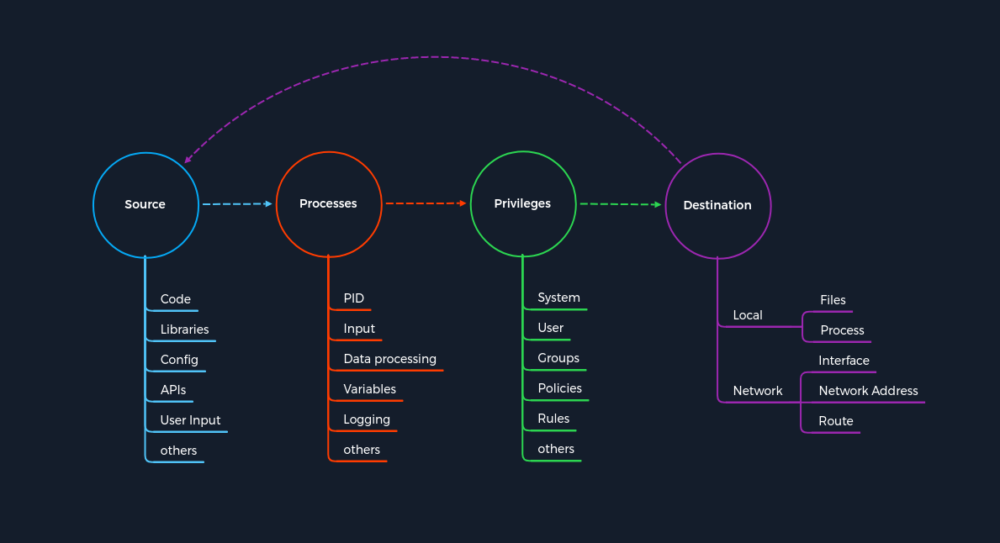

# Últimas vulnerabilidades de FTP

Ao discutir as vulnerabilidades mais recentes, focaremos esta seção e as seguintes em um dos ataques mostrados anteriormente e apresentá-lo-emos da forma mais simples possível, sem entrar em muitos detalhes técnicos. Isso deve nos ajudar a facilitar o conceito do ataque através de um exemplo relacionado a um serviço específico para um melhor entendimento.

Neste caso, discutiremos a vulnerabilidade ``CoreFTP`` antes da compilação ``727`` atribuída ``CVE-2022-22836``. Esta vulnerabilidade é para um serviço FTP que não processa corretamente a solicitação HTTP PUT e leva a uma passagem de ``diretório/caminho`` autenticado e vulnerabilidade de gravação arbitrária de arquivos. Esta vulnerabilidade nos permite gravar arquivos fora do diretório ao qual o serviço tem acesso.

## Conceito do ataque

Este serviço FTP usa uma solicitação ``HTTP POST`` para fazer upload de arquivos. No entanto, o serviço CoreFTP permite uma solicitação ``HTTP PUT``, que podemos usar para gravar conteúdo em arquivos. Vamos dar uma olhada no ataque com base em nosso conceito. A exploração desse ataque é relativamente simples, baseada em um único comando ``cURL``.

### Exploração CoreFTP

```bash
NycolasES6@htb[/htb]$ curl -k -X PUT -H "Host: <IP>" --basic -u <username>:<password> --data-binary "PoC." --path-as-is https://<IP>/../../../../../../whoops
```

Criamos uma solicitação ``HTTP PUT`` bruta (``-X PUT``) com autenticação básica (``--basic -u <nome de usuário>:<senha>``), o caminho para o arquivo (``--path-as-is https://\<IP> /../../../../../whoops``) e seu conteúdo (``--data-binary "PoC."``) com este comando. Além disso, especificamos o cabeçalho do host (``-H "Host: \<IP>"``) com o endereço IP do nosso sistema de destino.

### O conceito de ataques



Resumindo, o processo real interpreta mal a entrada do caminho pelo usuário. Isso faz com que o acesso à pasta restrita seja ignorado. Como resultado, as permissões de gravação na solicitação ``HTTP PUT`` não são controladas adequadamente, o que nos permite criar os arquivos que desejamos fora das pastas autorizadas. No entanto, pularemos a explicação do processo de autenticação básica e pularemos diretamente para a primeira parte da exploração.

### Travessia de diretório

| Etapa | Travessia de diretório | Conceito de Ataques - Categoria |
| - | - | - |
| 1. | O usuário especifica o tipo de solicitação HTTP com o conteúdo do arquivo, incluindo caracteres de escape para sair da área restrita. | Source |
| 2. | O tipo alterado de solicitação HTTP, o conteúdo do arquivo e o caminho inserido pelo usuário são assumidos e processados ​​pelo processo. | Process |
| 3. | O aplicativo verifica se o usuário está autorizado a estar no caminho especificado. Como as restrições se aplicam apenas a uma pasta específica, todas as permissões concedidas a ela são ignoradas à medida que ela sai dessa pasta usando a passagem de diretório. | Privileges |
| 4. | O destino é outro processo que tem a tarefa de escrever o conteúdo especificado do usuário no sistema local. | Destination |

Até este ponto, contornamos as restrições impostas pela aplicação usando os caracteres de escape (``../../../../``) e chegamos à segunda parte, onde o processo grava o conteúdo que especificamos em um arquivo de nossa escolha. É quando o ciclo recomeça, mas desta vez para gravar o conteúdo no sistema de destino.

### Gravação de arquivo arbitrário

| Etapa | Gravação de arquivo arbitrário | Conceito de Ataques - Categoria |
| - | - | - |
| 5. | As mesmas informações que o usuário inseriu são usadas como fonte. Neste caso, o nome do arquivo ( whoops) e o conteúdo ( --data-binary "PoC."). | Source |
| 6. | O processo pega as informações especificadas e continua gravando o conteúdo desejado no arquivo especificado. | Process |
| 7. | Como todas as restrições foram ignoradas durante a vulnerabilidade de passagem de diretório, o serviço aprova a gravação do conteúdo no arquivo especificado. | Privileges |
| 8. | O nome do arquivo especificado pelo usuário ( whoops) com o conteúdo desejado ( "PoC.") agora serve como destino no sistema local. | Destination |

Após a conclusão da tarefa, poderemos encontrar este arquivo com o conteúdo correspondente no sistema de destino.

### Sistema de destino

```powershell
C:\> type C:\whoops

PoC.
```
