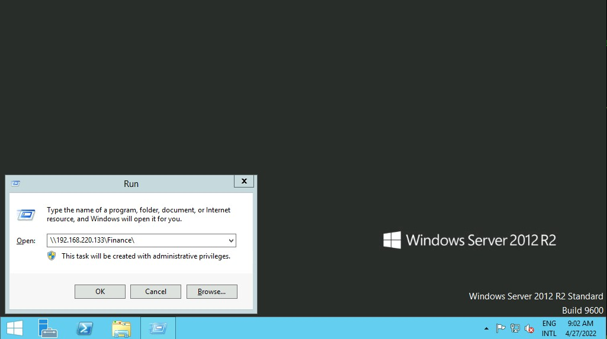
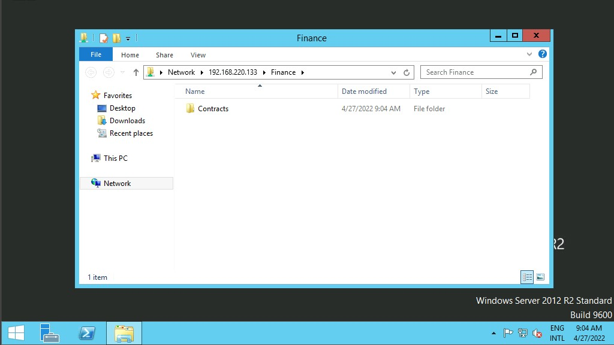
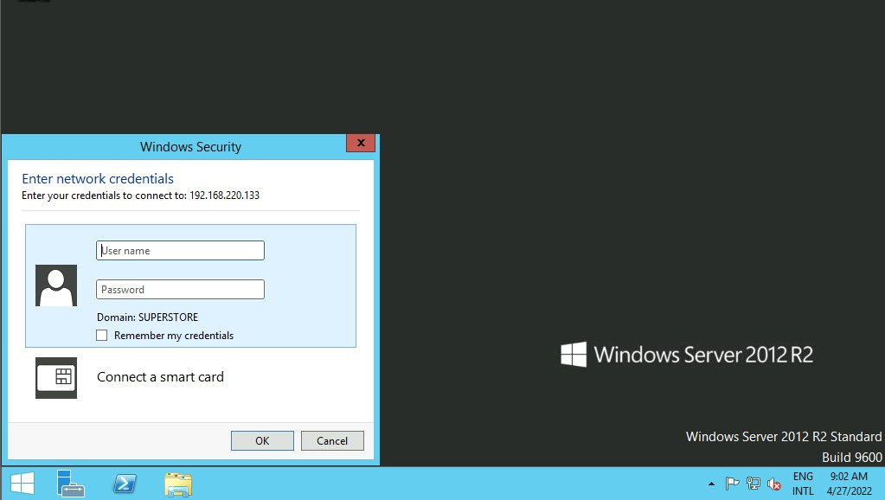
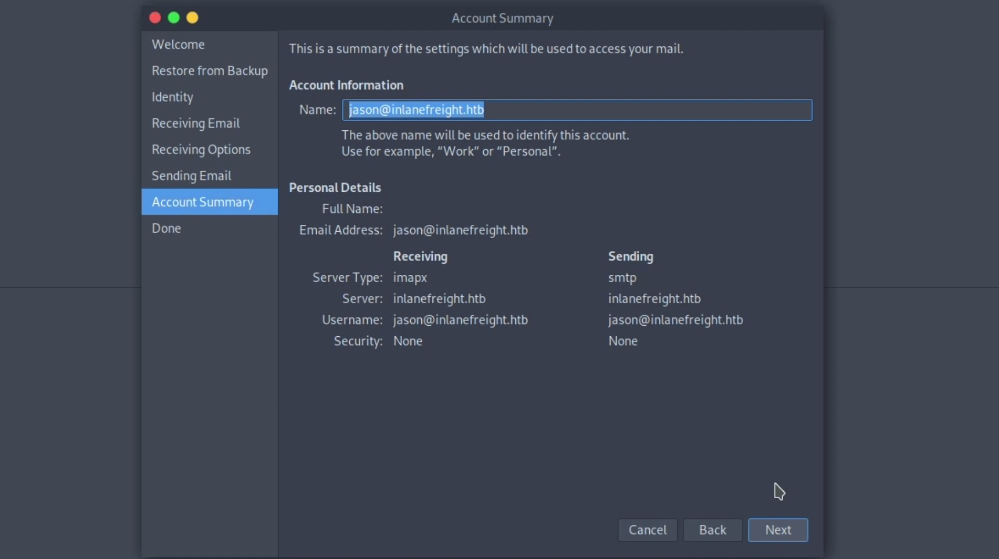
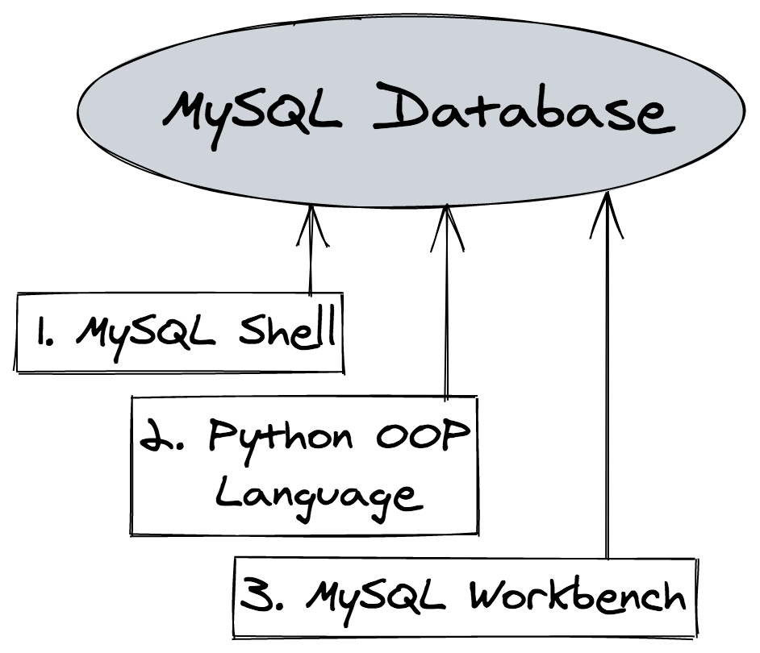
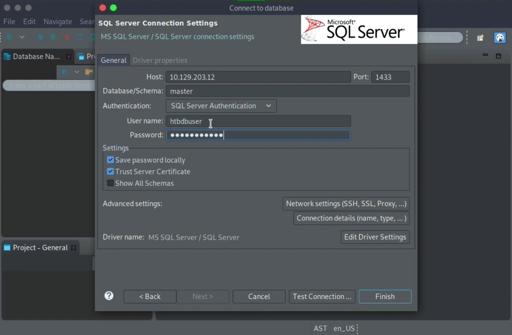
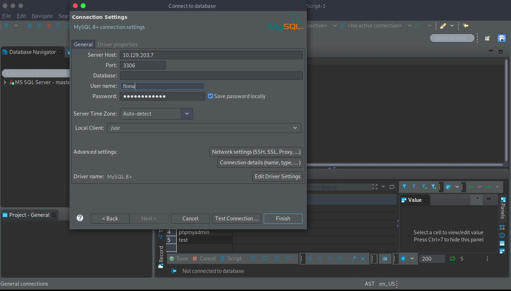

# Interagindo com serviços comuns

As vulnerabilidades são comumente descobertas por pessoas que usam e entendem de tecnologia, um protocolo ou um serviço. À medida que evoluímos neste campo, encontraremos diferentes serviços para interagir e precisaremos evoluir e aprender novas tecnologias constantemente.

Para sermos bem-sucedidos em atacar um serviço, precisamos saber seu propósito, como interagir com ele, quais ferramentas podemos usar e o que podemos fazer com ele. Esta seção se concentrará em serviços comuns e como podemos interagir com eles.

## Serviços de compartilhamento de arquivos

Um serviço de compartilhamento de arquivos é um tipo de serviço que fornece, medeia e monitora a transferência de arquivos de computador. Anos atrás, as empresas geralmente usavam apenas serviços internos para compartilhamento de arquivos, como SMB, NFS, FTP, TFTP, SFTP, mas à medida que a adoção da nuvem cresce, a maioria das empresas agora também tem serviços de nuvem de terceiros, como Dropbox, Google Drive, OneDrive, SharePoint ou outras formas de armazenamento de arquivos, como AWS S3, Azure Blob Storage ou Google Cloud Storage. Seremos expostos a uma mistura de serviços de compartilhamento de arquivos internos e externos, e precisamos estar familiarizados com eles.

Esta seção se concentrará em serviços internos, mas isso pode se aplicar ao armazenamento em nuvem sincronizado localmente com servidores e estações de trabalho.

## Bloco de mensagens do servidor (SMB)

O SMB é comumente usado em redes Windows e geralmente encontramos pastas de compartilhamento em uma rede Windows. Podemos interagir com o SMB usando a GUI, CLI ou ferramentas. Vamos abordar algumas maneiras comuns de interagir com o SMB usando o Windows & Linux.

### Windows

Há diferentes maneiras de interagir com uma pasta compartilhada usando o Windows, e vamos explorar algumas delas. Na GUI do Windows, podemos pressionar para abrir a caixa de diálogo Executar e digitar o local de compartilhamento de arquivos, por exemplo: ``[WINKEY] + [R]\\192.168.220.129\Finance\``



Suponha que a pasta compartilhada permita autenticação anônima ou sejamos autenticados com um usuário que tenha privilégio sobre essa pasta compartilhada. Nesse caso, não receberemos nenhuma forma de solicitação de autenticação e ela exibirá o conteúdo da pasta compartilhada.



Se não tivermos acesso, receberemos uma solicitação de autenticação.



O Windows tem dois shells de linha de comando: o ``shell de comando`` e o ``PowerShell``. Cada shell é um programa de software que fornece comunicação direta entre nós e o sistema operacional ou aplicativo, fornecendo um ambiente para automatizar as operações de TI.

Vamos discutir alguns comandos para interagir com o compartilhamento de arquivos usando o Shell de Comando () e o . O comando dir exibe uma lista de arquivos e subdiretórios de um diretório.CMDPowerShell

### Windows CMD - DIR

```powershell
C:\htb> dir \\192.168.220.129\Finance\

Volume in drive \\192.168.220.129\Finance has no label.
Volume Serial Number is ABCD-EFAA

Directory of \\192.168.220.129\Finance

02/23/2022  11:35 AM    <DIR>          Contracts
               0 File(s)          4,096 bytes
               1 Dir(s)  15,207,469,056 bytes free
```

O comando net use conecta um computador ou desconecta um computador de um recurso compartilhado ou exibe informações sobre conexões de computador. Podemos nos conectar a um compartilhamento de arquivos com o seguinte comando e mapear seu conteúdo para a letra da unidade.n

### Windows CMD - Uso de rede

```powershell
C:\htb> net use n: \\192.168.220.129\Finance

The command completed successfully.
```

Também podemos fornecer um nome de usuário e senha para autenticar o compartilhamento.

```powershell
C:\htb> net use n: \\192.168.220.129\Finance /user:plaintext Password123

The command completed successfully.
```

Com a pasta compartilhada mapeada como a unidade, podemos executar comandos do Windows como se essa pasta compartilhada estivesse em nosso computador local. Vamos descobrir quantos arquivos a pasta compartilhada e seus subdiretórios contêm.n

### Windows CMD - dir


```powershell
C:\htb> dir n: /a-d /s /b | find /c ":\"

29302
```

Foram encontrados 29.302 arquivos. Vamos percorrer o comando:

```powershell
dir n: /a-d /s /b | find /c ":\"
```

| Sintaxe | Descrição |
| - | - |
| dir | Aplicativo|
|n: | Diretório ou unidade para pesquisar|
|/a-d | ``/a`` é o atributo e ``-d`` significa que não é diretório|
|/s | Exibe arquivos em um diretório especificado e todos os subdiretórios|
|/b | Usa formato simples (sem informações de título ou resumo)|

O comando a seguir ``| find /c ":\\"`` processa a saída de ``dir n: /a-d /s /b`` para contar quantos arquivos existem no diretório e subdiretórios. Você pode usar ``dir /?`` para ver a ajuda completa. Pesquisar 29.302 arquivos é demorado, scripts e utilitários de linha de comando podem nos ajudar a acelerar a pesquisa. Com ``dir`` podemos pesquisar nomes específicos em arquivos como:

- crédito
- senha
- Usuários
- segredos
- chave
- Extensões de arquivo comuns para código-fonte, como: .cs, .c, .go, .java, .php, .asp, .aspx, .html.

```powershell
C:\htb>dir n:\*cred* /s /b

n:\Contracts\private\credentials.txt


C:\htb>dir n:\*secret* /s /b

n:\Contracts\private\secret.txt
```

Se quisermos pesquisar uma palavra específica em um arquivo de texto, podemos usar ``findstr`` .

### CMD do Windows - Findstr

```powershell
c:\htb>findstr /s /i cred n:\*.*

n:\Contracts\private\secret.txt:file with all credentials
n:\Contracts\private\credentials.txt:admin:SecureCredentials!
```

### Windows PowerShell

O PowerShell foi projetado para estender os recursos do shell de comando para executar comandos do PowerShell chamados ``cmdlets``. Os cmdlets são semelhantes aos comandos do Windows, mas fornecem uma linguagem de script mais extensível. Podemos executar comandos do Windows e cmdlets do PowerShell no PowerShell, mas o shell de comando só pode executar comandos do Windows e não cmdlets do PowerShell. Vamos replicar os mesmos comandos agora usando o Powershell.


```powershell
PS C:\htb> Get-ChildItem \\192.168.220.129\Finance\

    Directory: \\192.168.220.129\Finance

Mode                 LastWriteTime         Length Name
----                 -------------         ------ ----
d-----         2/23/2022   3:27 PM                Contracts
```

Em vez de ``net use``, podemos usar ``New-PSDrive`` no PowerShell.

```powershell
PS C:\htb> New-PSDrive -Name "N" -Root "\\192.168.220.129\Finance" -PSProvider "FileSystem"

Name           Used (GB)     Free (GB) Provider      Root                                               CurrentLocation
----           ---------     --------- --------      ----                                               ---------------
N                                      FileSystem    \\192.168.220.129\Finance
```

Para fornecer um nome de usuário e senha com o Powershell, precisamos criar um ``objeto PSCredential`` . Ele oferece uma maneira centralizada de gerenciar nomes de usuário, senhas e credenciais.

### Windows PowerShell - Objeto PSCredential

```powershell
PS C:\htb> $username = 'plaintext'
PS C:\htb> $password = 'Password123'
PS C:\htb> $secpassword = ConvertTo-SecureString $password -AsPlainText -Force
PS C:\htb> $cred = New-Object System.Management.Automation.PSCredential $username, $secpassword
PS C:\htb> New-PSDrive -Name "N" -Root "\\192.168.220.129\Finance" -PSProvider "FileSystem" -Credential $cred

Name           Used (GB)     Free (GB) Provider      Root                                                              CurrentLocation
----           ---------     --------- --------      ----                                                              ---------------
N                                      FileSystem    \\192.168.220.129\Finance
```

No PowerShell, podemos usar o comando ``Get-ChildItem`` ou a variante curta ``gci``em vez do comando ``dir``.

### Windows PowerShell-GCI

```powershell
PS C:\htb> N:
PS N:\> (Get-ChildItem -File -Recurse | Measure-Object).Count

29302
```
Podemos usar a propriedade ``-Include`` para encontrar itens específicos do diretório especificado pelo parâmetro Path.

```powershell
PS C:\htb> Get-ChildItem -Recurse -Path N:\ -Include *cred* -File

    Directory: N:\Contracts\private

Mode                 LastWriteTime         Length Name
----                 -------------         ------ ----
-a----         2/23/2022   4:36 PM             25 credentials.txt
```

O cmdlet ``Select-String`` usa correspondência de expressões regulares para procurar padrões de texto em cadeias de caracteres e arquivos de entrada. Podemos usar ``Select-String`` algo semelhante ao ``grep`` do UNIX ou ``findstr.exe`` do Windows.

### Windows PowerShell - String de seleção

```powershell
PS C:\htb> Get-ChildItem -Recurse -Path N:\ | Select-String "cred" -List

N:\Contracts\private\secret.txt:1:file with all credentials
N:\Contracts\private\credentials.txt:1:admin:SecureCredentials!
```

A CLI permite que as operações de TI automatizem tarefas rotineiras, como gerenciamento de contas de usuários, backups noturnos ou interação com muitos arquivos. Podemos realizar operações com mais eficiência usando scripts do que a interface do usuário ou GUI.

### Linux

Máquinas Linux (UNIX) também podem ser usadas para navegar e montar compartilhamentos SMB. Observe que isso pode ser feito independentemente de o servidor de destino ser uma máquina Windows ou um servidor Samba. Embora algumas distribuições Linux suportem uma GUI, nos concentraremos nos utilitários e ferramentas de linha de comando do Linux para interagir com SMB. Vamos abordar como montar compartilhamentos SMB para interagir com diretórios e arquivos localmente.

### Linux - Montar

```bash
NycolasES6@htb[/htb]$ sudo mkdir /mnt/Finance
NycolasES6@htb[/htb]$ sudo mount -t cifs -o username=plaintext,password=Password123,domain=. //192.168.220.129/Finance /mnt/Finance
```

Como alternativa, podemos usar um arquivo de credenciais.

```bash
NycolasES6@htb[/htb]$ mount -t cifs //192.168.220.129/Finance /mnt/Finance -o credentials=/path/credentialfile
```

O arquivo ``credentialfile`` deve ser estruturado assim:

### Arquivo de credenciais

```txt
username=plaintext
password=Password123
domain=.
```

> Nota: Precisamos instalar ``cifs-utils`` para conectar-se a uma pasta de compartilhamento SMB. Para instalá-lo podemos executar a partir da linha de comando ``sudo apt install cifs-utils``.

Depois que uma pasta compartilhada for montada, você poderá usar ferramentas comuns do Linux, como ``find`` ou ``grep`` para interagir com a estrutura do arquivo. Vamos procurar um nome de arquivo que contenha a string ``cred``:

### Linux - Encontrar

```bash
NycolasES6@htb[/htb]$ find /mnt/Finance/ -name *cred*

/mnt/Finance/Contracts/private/credentials.txt
```

A seguir, vamos encontrar os arquivos que contêm a string ``cred``:

```bash
NycolasES6@htb[/htb]$ grep -rn /mnt/Finance/ -ie cred

/mnt/Finance/Contracts/private/credentials.txt:1:admin:SecureCredentials!
/mnt/Finance/Contracts/private/secret.txt:1:file with all credentials
```

## Outros serviços

Existem outros serviços de compartilhamento de arquivos, como FTP, TFTP e NFS, que podemos anexar (montar) usando diferentes ferramentas e comandos. Porém, uma vez montado um serviço de compartilhamento de arquivos, devemos entender que podemos utilizar as ferramentas disponíveis no Linux ou Windows para interagir com arquivos e diretórios. À medida que descobrimos novos serviços de compartilhamento de arquivos, precisaremos investigar como eles funcionam e quais ferramentas podemos usar para interagir com eles.

## Email

Normalmente precisamos de dois protocolos para enviar e receber mensagens, um para enviar e outro para receber. O Simple Mail Transfer Protocol (SMTP) é um protocolo de entrega de e-mail usado para enviar e-mails pela Internet. Da mesma forma, um protocolo de suporte deve ser usado para recuperar um email de um serviço. Existem dois protocolos principais que podemos usar POP3 e IMAP.

Podemos usar um cliente de e-mail como o Evolution , o gerenciador oficial de informações pessoais, e um cliente de e-mail para o Ambiente de Trabalho GNOME. Podemos interagir com um servidor de email para enviar ou receber mensagens com um cliente de email. Para instalar o Evolution, podemos usar o seguinte comando:

### Linux - Instale o Evolution

```bash
NycolasES6@htb[/htb]$ sudo apt-get install evolution
...SNIP...
```

> Nota: Se aparecer um erro ao iniciar o Evolution indicando "bwrap: Can't create file at ...", use este comando para iniciar o Evolution ``export WEBKIT_FORCE_SANDBOX=0 && evolution``.

### Vídeo - Conectando-se ao IMAP e SMTP usando o Evolution

Clique na imagem abaixo para ver um breve vídeo de demonstração.

[](https://www.youtube.com/watch?v=xelO2CiaSVs)

Podemos usar o nome de domínio ou endereço IP do servidor de e-mail. Se o servidor usar SMTPS ou IMAPS, precisaremos do método de criptografia apropriado (TLS em uma porta dedicada ou STARTTLS após conexão). Podemos usar a opção de autenticação ``Check for Supported Types`` para confirmar se o servidor suporta o método selecionado.

### Banco de dados

Os bancos de dados são normalmente usados ​​em empresas, e a maioria das empresas os utiliza para armazenar e gerenciar informações. Existem diferentes tipos de bancos de dados, como bancos de dados hierárquicos, bancos de dados NoSQL (ou não relacionais) e bancos de dados relacionais SQL. Vamos nos concentrar nos bancos de dados relacionais SQL e nos dois bancos de dados relacionais mais comuns, chamados MySQL e MSSQL. Temos três maneiras comuns de interagir com bancos de dados:

1. Utilitários de linha de comando ( ``mysql`` ou ``sqsh``)
2. Um aplicativo GUI para interagir com bancos de dados como HeidiSQL, MySQL Workbench ou SQL Server Management Studio.
3. Linguagens de programação

### Exemplo de MySQL



Vamos explorar utilitários de linha de comando e um aplicativo GUI.

## Utilitários de linha de comando

### MSSQL

Para interagir com ``MSSQL (Microsoft SQL Server)`` com Linux podemos usar ``sqsh`` ou ``sqlcmd`` se você estiver usando Windows. ``Sqsh`` é muito mais do que uma solicitação amigável. O objetivo é fornecer muitas das funcionalidades fornecidas por um shell de comando, como variáveis, alias, redirecionamento, pipes, back-grounding, controle de trabalho, histórico, substituição de comando e configuração dinâmica. Podemos iniciar uma sessão SQL interativa da seguinte maneira:

### Linux-SQSH

```bash
NycolasES6@htb[/htb]$ sqsh -S 10.129.20.13 -U username -P Password123
```

O ``sqlcmd`` utilitário permite inserir instruções ``Transact-SQL``, procedimentos do sistema e arquivos de script por meio de vários modos disponíveis:

- No prompt de comando.
- No Editor de Consultas no modo SQLCMD.
- Em um arquivo de script do Windows.
- Em uma etapa de trabalho do sistema operacional (Cmd.exe) de um trabalho do SQL Server Agent.

### Windows-SQLCMD

```powershell
C:\htb> sqlcmd -S 10.129.20.13 -U username -P Password123
 ```

Para saber mais sobre o ``sqlcmd`` uso, você pode consultar a documentação da Microsoft .

## Linux-MySQL

```bash
NycolasES6@htb[/htb]$ mysql -u username -pPassword123 -h 10.129.20.13
```

Podemos facilmente iniciar uma sessão SQL interativa usando o Windows:

### Windows-MySQL

```powershell
C:\htb> mysql.exe -u username -pPassword123 -h 10.129.20.13
```

### Aplicativo GUI

Os mecanismos de banco de dados geralmente possuem seu próprio aplicativo GUI. MySQL possui MySQL Workbench e MSSQL possui SQL Server Management Studio ou SSMS , podemos instalar essas ferramentas em nosso host de ataque e conectar-se ao banco de dados. SSMS só é compatível com Windows. Uma alternativa é usar ferramentas comunitárias como o dbeaver . dbeaver é uma ferramenta de banco de dados multiplataforma para Linux, macOS e Windows que suporta conexão com vários mecanismos de banco de dados, como MSSQL, MySQL, PostgreSQL, entre outros, facilitando para nós, como invasores, a interação com servidores de banco de dados comuns.

Para instalar o dbeaver usando um pacote Debian, podemos baixar o pacote .deb de lançamento em [dbeaver](https://github.com/dbeaver/dbeaver/releases) e executar o seguinte comando:

### Instale o dbeaver

```bash
NycolasES6@htb[/htb]$ sudo dpkg -i dbeaver-<version>.deb
```

Para iniciar o uso do aplicativo:

### Execute dbeaver

```bash
NycolasES6@htb[/htb]$ dbeaver &
```

Para conectar-se a um banco de dados, precisaremos de um conjunto de credenciais, o IP de destino e o número da porta do banco de dados e o mecanismo de banco de dados ao qual estamos tentando nos conectar (MySQL, MSSQL ou outro).

### Vídeo - Conectando-se ao banco de dados MSSQL usando dbeaver

Clique na imagem abaixo para ver um breve vídeo de demonstração de como conectar-se a um banco de dados MSSQL usando ``dbeaver``.

[](https://www.youtube.com/watch?v=gU6iQP5rFMw)

Clique na imagem abaixo para ver um breve vídeo de demonstração de como conectar-se a um banco de dados MySQL usando dbeaver.

### Vídeo - Conectando-se ao banco de dados MySQL usando dbeaver

[](https://www.youtube.com/watch?v=PeuWmz8S6G8)

Assim que tivermos acesso ao banco de dados usando um utilitário de linha de comando ou um aplicativo GUI, podemos usar instruções Transact-SQL comuns para enumerar bancos de dados e tabelas contendo informações confidenciais, como nomes de usuário e senhas. Se tivermos os privilégios corretos, poderemos potencialmente executar comandos como a conta de serviço MSSQL. Posteriormente neste módulo, discutiremos instruções e ataques Transact-SQL comuns para bancos de dados MSSQL e MySQL.

### Ferramentas

É crucial familiarizar-se com os utilitários de linha de comando padrão disponíveis para interagir com diferentes serviços. Porém, à medida que avançamos na área, encontraremos ferramentas que podem nos ajudar a ser mais eficientes. A comunidade geralmente cria essas ferramentas. Embora, eventualmente, tenhamos ideias sobre como uma ferramenta pode ser melhorada ou como criar nossas próprias ferramentas, mesmo que não sejamos desenvolvedores em tempo integral, mais nos familiarizamos com hacking. Quanto mais aprendemos, mais nos encontramos em busca de uma ferramenta que não existe, que pode ser uma oportunidade para aprender e criar nossas ferramentas.

### Ferramentas para interagir com serviços comuns

| SMB | FTP | Email | Databases |
| - | - | - | - |
| smbclient | ftp | Thunderbird | mssql-cli |
| CrackMapExec | lftp | Claws | mycli |
| SMBMap | ncftp | Geary | mssqlclient.py |
| Impacket | filezilla | MailSpring | dbeaver |
| psexec.py | crossftp | mutt | MySQL Workbench |
| smbexec.py |  | mailutils | SQL Server Management Studio or SSMS
|  |  | sendEmail |  |
|  |  | swaks |  |
|  |  | sendmail |  |

## Solução geral de problemas

Dependendo da versão do Windows ou Linux com a qual estamos trabalhando ou visando, podemos encontrar diversos problemas ao tentar nos conectar a um serviço.

Algumas razões pelas quais podemos não ter acesso a um recurso:

- Autenticação
- Privilégios
- Conexão de rede
- Regras de firewall
- Suporte a protocolo

Lembre-se de que podemos encontrar erros diferentes dependendo do serviço que pretendemos. Podemos usar os códigos de erro a nosso favor e procurar documentação oficial ou fóruns onde pessoas resolveram um problema semelhante ao nosso.


