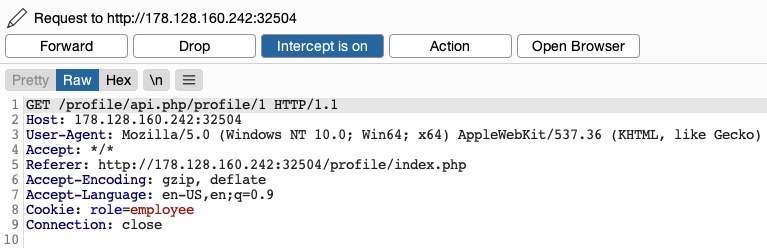
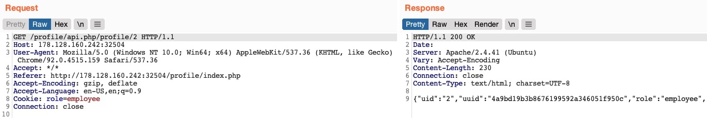
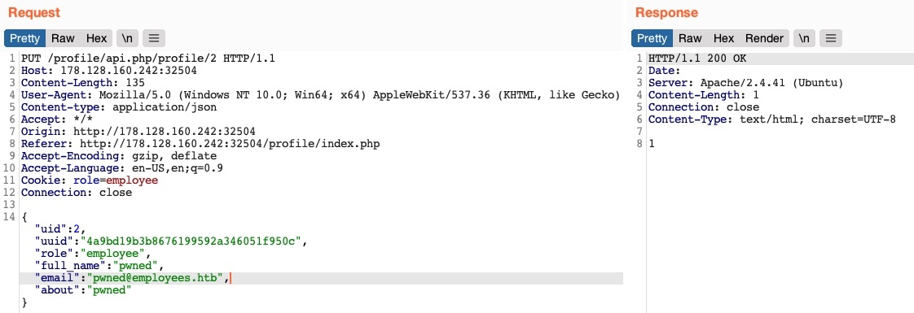
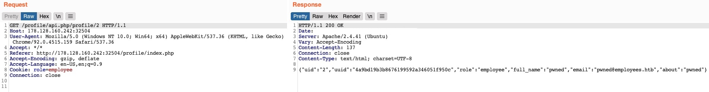
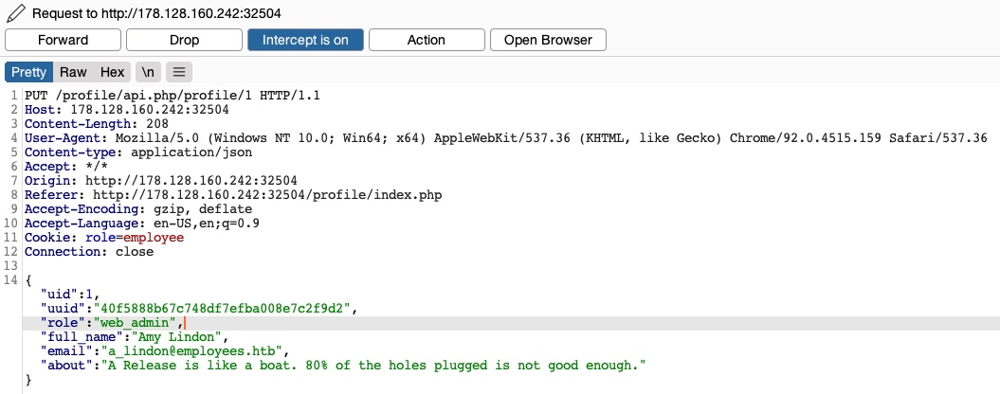
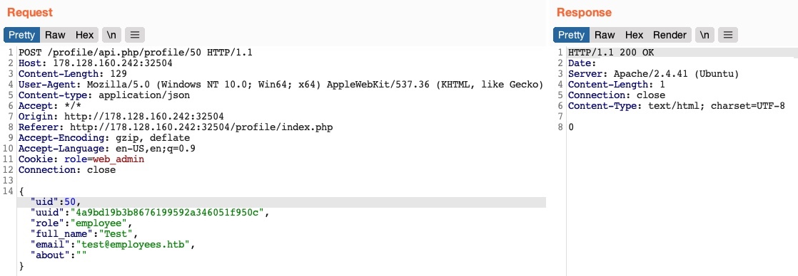
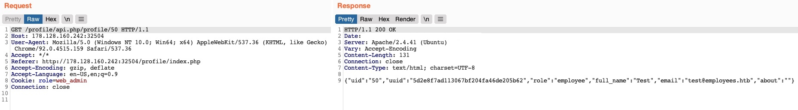

# Encadeando vulnerabilidades IDOR

Normalmente, uma solicitação GET para o endpoint da API deve retornar os detalhes do usuário solicitado, então podemos tentar chamá-lo para ver se podemos recuperar os detalhes do nosso usuário. Também notamos que após o carregamento da página, ela busca os detalhes do usuário com uma solicitação GET para o mesmo endpoint da API:

com uma solicitação GET para o mesmo endpoint da API:



Conforme mencionado na seção anterior, a única forma de autorização em nossas solicitações HTTP é o cookie role=employee, pois a solicitação HTTP não contém nenhuma outra forma de autorização específica do usuário, como um token JWT, por exemplo. Mesmo que existisse um token, a menos que estivesse sendo comparado ativamente com os detalhes do objeto solicitado por um sistema de controle de acesso back-end, ainda poderemos recuperar os detalhes de outros usuários.

## Divulgação de informação


Vamos enviar uma solicitação ``GET`` com outro uid:



Como podemos ver, isso retornou os detalhes de outro usuário, com seu próprio uuid e função, confirmando uma vulnerabilidade de divulgação de informações do IDOR:

```json
{
    "uid": "2",
    "uuid": "4a9bd19b3b8676199592a346051f950c",
    "role": "employee",
    "full_name": "Iona Franklyn",
    "email": "i_franklyn@employees.htb",
    "about": "It takes 20 years to build a reputation and few minutes of cyber-incident to ruin it."
}
```

Isso nos fornece novos detalhes, principalmente o uuid, que não podíamos calcular antes e, portanto, não podíamos alterar os detalhes de outros usuários.

## Modificando detalhes de outros usuários

Agora, com o uuid do usuário em mãos, podemos alterar os detalhes deste usuário enviando uma solicitação PUT para /profile/api.php/profile/2 com os detalhes acima junto com quaisquer modificações que fizemos, como segue:



Desta vez, não recebemos nenhuma mensagem de erro de controle de acesso e, quando tentamos OBTER os detalhes do usuário novamente, vemos que realmente atualizamos seus detalhes:



Além de nos permitir visualizar detalhes potencialmente confidenciais, a capacidade de modificar os dados de outro usuário também nos permite realizar vários outros ataques. Um tipo de ataque é modificar o endereço de e-mail de um usuário e, em seguida, solicitar um link de redefinição de senha, que será enviado para o endereço de e-mail que especificamos, permitindo-nos assumir o controle de sua conta. Outro ataque potencial é colocar uma carga útil XSS no campo 'sobre', que seria executada assim que o usuário visitasse a página Editar perfil, permitindo-nos atacar o usuário de diferentes maneiras.

## Encadeando duas vulnerabilidades IDOR

Como identificamos uma vulnerabilidade de divulgação de informações do IDOR, também podemos enumerar todos os usuários e procurar outras funções, de preferência uma função administrativa. Tente escrever um script para enumerar todos os usuários, de forma semelhante ao que fizemos anteriormente.

Depois de enumerarmos todos os usuários, encontraremos um usuário administrador com os seguintes detalhes:

```json
{
    "uid": "X",
    "uuid": "a36fa9e66e85f2dd6f5e13cad45248ae",
    "role": "web_admin",
    "full_name": "administrator",
    "email": "webadmin@employees.htb",
    "about": "HTB{FLAG}"
}
```

Podemos modificar os detalhes do administrador e então realizar um dos ataques acima para assumir o controle de sua conta. No entanto, como agora sabemos o nome da função administrativa (web_admin), podemos configurá-lo para nosso usuário para que possamos criar novos usuários ou excluir usuários atuais. Para fazer isso, interceptaremos a solicitação ao clicar no botão Atualizar perfil e mudaremos nossa função para web_admin:



Desta vez, não recebemos a mensagem de erro de função inválida, nem nenhuma mensagem de erro de controle de acesso, o que significa que não há medidas de controle de acesso de back-end para quais funções podemos definir para nosso usuário. Se obtivermos os detalhes do usuário, veremos que nossa função foi realmente definida como web_admin:

```json
{
    "uid": "1",
    "uuid": "40f5888b67c748df7efba008e7c2f9d2",
    "role": "web_admin",
    "full_name": "Amy Lindon",
    "email": "a_lindon@employees.htb",
    "about": "A Release is like a boat. 80% of the holes plugged is not good enough."
}
```

Agora, podemos atualizar a página para atualizar nosso cookie ou defini-lo manualmente como Cookie: role=web_admin e então interceptar a solicitação Update para criar um novo usuário e ver se teremos permissão para fazer isso:



Não recebemos nenhuma mensagem de erro desta vez. Se enviarmos uma solicitação GET para o novo usuário, veremos que ele foi criado com sucesso:



Ao combinar as informações que obtivemos da vulnerabilidade de divulgação de informações do IDOR com um ataque de chamadas de função inseguras do IDOR em um endpoint de API, poderíamos modificar os detalhes de outros usuários e criar/excluir usuários, ignorando várias verificações de controle de acesso em vigor. Em muitas ocasiões, as informações que vazamos através de vulnerabilidades IDOR podem ser utilizadas em outros ataques, como IDOR ou XSS, levando a ataques mais sofisticados ou contornando os mecanismos de segurança existentes.

Com nossa nova função, também podemos realizar atribuições em massa para alterar campos específicos para todos os usuários, como colocar cargas XSS em seus perfis ou alterar seu e-mail para um e-mail que especificamos. Tente escrever um script que altere o email de todos os usuários para um email de sua escolha. Você pode fazer isso recuperando seus uuids e enviando uma solicitação PUT para cada um com o novo email.
