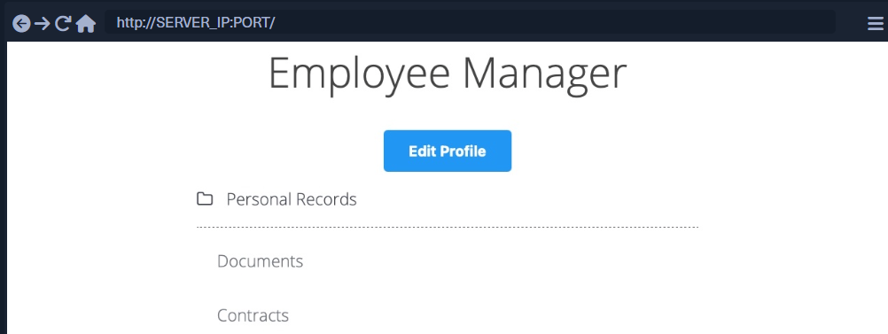
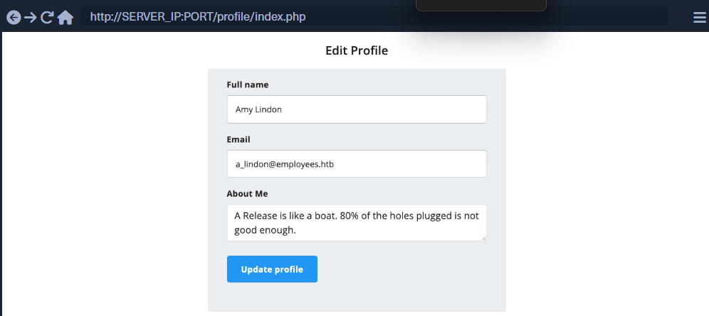
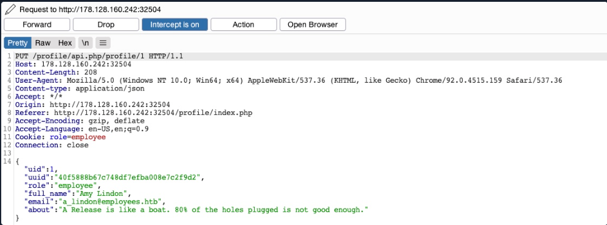
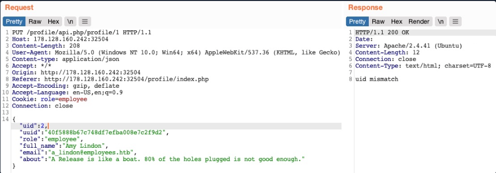
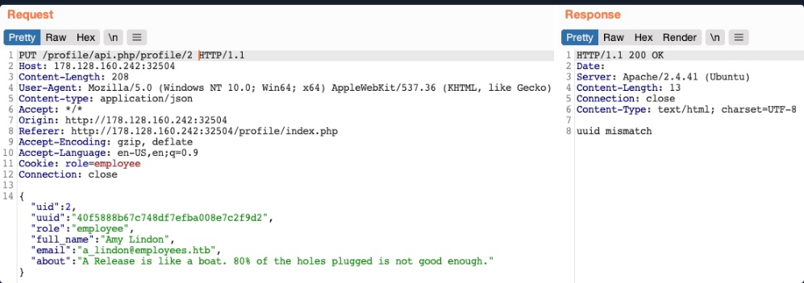
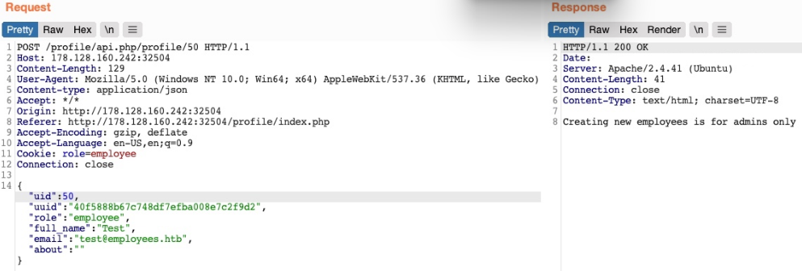

# IDOR em APIs inseguras

Até o momento, utilizamos vulnerabilidades do IDOR apenas para acessar arquivos e recursos que estão fora do acesso de nossos usuários. No entanto, vulnerabilidades do IDOR também podem existir em chamadas de função e APIs, e explorar-las nos permitiria realizar várias ações como outros usuários.

Embora as vulnerabilidades de divulgação de informações do IDOR permitam ler vários tipos de recursos, as chamadas de função inseguras do IDOR nos permitem chamar APIs ou executar funções como outro usuário. Essas funções e APIs podem ser usadas para alterar informações privadas de outro usuário, redefinir a senha de outro usuário ou até mesmo comprar itens usando as informações de pagamento de outro usuário. Em muitos casos, podemos obter certas informações por meio de uma vulnerabilidade IDOR de divulgação de informações e, em seguida, usar essas informações com vulnerabilidades de chamadas de função inseguras do IDOR, como veremos mais adiante neste módulo.

## Identificando APIs inseguras

Voltando ao nosso aplicativo da web Employee Manager, podemos começar a testar a página Editar perfil para vulnerabilidades IDOR:



Ao clicar no botão ``Edit Profile``, somos levados a uma página para editar informações do nosso perfil de usuário, nomeadamente Full Name, Email, e About Me, que é um recurso comum em muitas aplicações web:



Podemos alterar qualquer um dos detalhes do nosso perfil e clicar em ``Update profile``, e veremos que eles são atualizados e persistem durante as atualizações, o que significa que são atualizados em um banco de dados em algum lugar. Vamos interceptar a ``Update`` solicitação no Burp e dar uma olhada:



Vemos que a página está enviando uma solicitação PUT para o endpoint da API /profile/api.php/profile/1. Solicitações PUT geralmente são usadas em APIs para atualizar detalhes de itens, enquanto POST é usado para criar novos itens, DELETE para excluir itens e GET para recuperar detalhes de itens. Portanto, é esperada uma solicitação PUT para a função Atualizar perfil. A parte interessante são os parâmetros JSON que ele está enviando:

```json
{
    "uid": 1,
    "uuid": "40f5888b67c748df7efba008e7c2f9d2",
    "role": "employee",
    "full_name": "Amy Lindon",
    "email": "a_lindon@employees.htb",
    "about": "A Release is like a boat. 80% of the holes plugged is not good enough."
}
```

Vemos que a solicitação ``PUT`` inclui alguns parâmetros ocultos, como ``uid``, ``uuid`` e, o mais interessante, ``role``, que é definido como funcionário. A aplicação web também parece estar definindo os privilégios de acesso do usuário (por exemplo, função) no lado do cliente, na forma de nosso Cookie: ``role=employee`` , que parece refletir a função especificada para nosso usuário. Este é um problema de segurança comum. Os privilégios de controle de acesso são enviados como parte da solicitação HTTP do cliente, seja como um cookie ou como parte da solicitação JSON, deixando-o sob o controle do cliente, que pode ser manipulado para obter mais privilégios.

uma função arbitrária para nosso usuário, o que pode nos conceder mais privilégios. No entanto, como saberíamos quais outras funções existem?

## Exploiting Insecure APIs

Sabemos que podemos alterar os parâmetros full_name, email e about, pois estes são os que estão sob nosso controle no formulário HTML na página /profile. Então, vamos tentar manipular os outros parâmetros.

Existem algumas coisas que podemos tentar neste caso:

1. Altere nosso uid para o uid de outro usuário, para que possamos assumir o controle de suas contas
2. Alterar os dados de outro usuário, o que pode nos permitir realizar vários ataques na web
3. Crie novos usuários com detalhes arbitrários ou exclua usuários existentes
4. Mude nossa função para uma função mais privilegiada (por exemplo, administrador) para poder realizar mais ações

Vamos começar alterando nosso uid para o uid de outro usuário (por exemplo, "uid": 2). No entanto, qualquer número que definimos diferente do nosso próprio uid nos dá uma resposta de incompatibilidade de uid:



O aplicativo Web parece estar comparando a solicitação ``uid`` com o endpoint da API ( ``/1``). Isso significa que uma forma de controle de acesso no back-end nos impede de alterar arbitrariamente alguns parâmetros JSON, o que pode ser necessário para evitar que a aplicação web trave ou retorne erros.

Talvez possamos tentar alterar os dados de outro usuário. Alteraremos o endpoint da API para ``/profile/api.php/profile/2`` e mudaremos ``"uid": 2`` para evitar o anterior ``uid mismatch``:



Como podemos ver, desta vez recebemos uma mensagem de erro dizendo incompatibilidade de uuid. O aplicativo da web parece estar verificando se o valor uuid que estamos enviando corresponde ao uuid do usuário. Como estamos enviando nosso próprio uuid, nossa solicitação está falhando. Esta parece ser outra forma de controle de acesso para evitar que usuários alterem os detalhes de outro usuário.

A seguir, vamos ver se podemos criar um novo usuário com uma solicitação POST para o endpoint da API. Podemos alterar o método de solicitação para POST, alterar o uid para um novo uid e enviar a solicitação para o endpoint da API do novo uid:



Recebemos uma mensagem de erro dizendo A criação de novos funcionários é apenas para administradores. A mesma coisa acontece quando enviamos uma solicitação de exclusão, pois a exclusão de funcionários é apenas para administradores. O aplicativo da web pode estar verificando nossa autorização por meio do cookie role=employee porque esta parece ser a única forma de autorização na solicitação HTTP.

Finalmente, vamos tentar mudar nossa função para admin/administrador para obter privilégios mais elevados. Infelizmente, sem saber um nome de função válido, obtemos uma função inválida na resposta HTTP e nossa função não é atualizada:


Portanto, todas as nossas tentativas parecem ter falhado. Não podemos criar ou excluir usuários, pois não podemos alterar nossa função. Não podemos alterar o nosso próprio uid, pois existem medidas preventivas no back-end que não podemos controlar, nem podemos alterar os dados de outro utilizador pelo mesmo motivo. Então, a aplicação web é segura contra ataques IDOR?

Até agora, testamos apenas as chamadas de função inseguras do IDOR. No entanto, não testamos a solicitação GET da API para vulnerabilidades de divulgação de informações do IDOR. Se não houvesse um sistema robusto de controle de acesso, poderíamos ler os detalhes de outros usuários, o que pode nos ajudar nos ataques anteriores que tentamos.

Tente testar a API contra vulnerabilidades de divulgação de informações do IDOR, tentando obter detalhes de outros usuários com solicitações GET. Se a API estiver vulnerável, poderemos vazar detalhes de outros usuários e então usar essas informações para completar nossos ataques IDOR nas chamadas de função.
