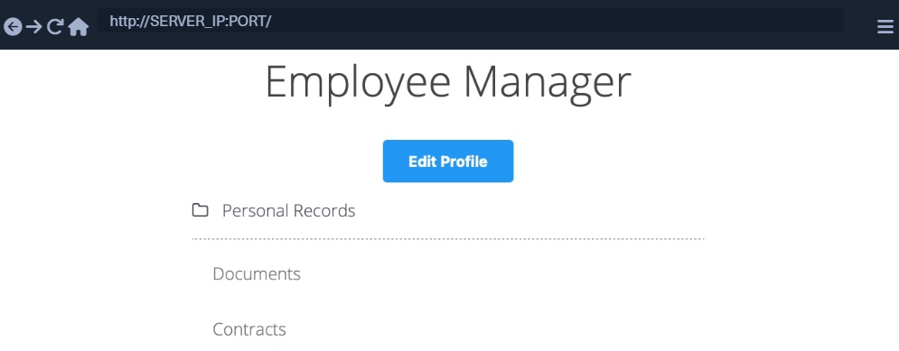
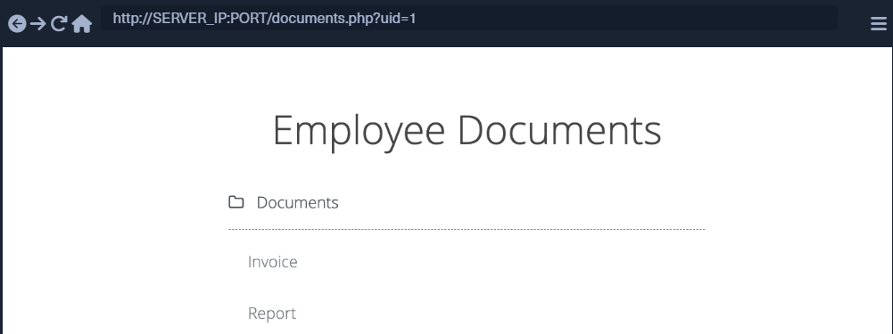
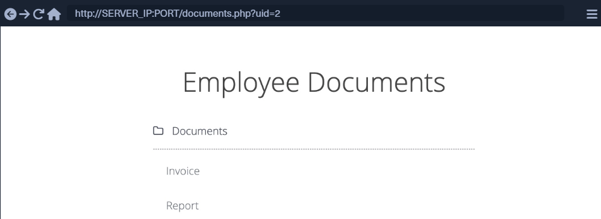

# Enumeração de IDOR em massa

Vamos começar a discutir várias técnicas de exploração de vulnerabilidades IDOR, desde a enumeração básica até a coleta de dados em massa, até o escalonamento de privilégios do usuário.

## Parâmetros inseguros

Vamos começar com um exemplo básico que mostra uma vulnerabilidade IDOR típica. O exercício abaixo é uma  aplicação web `Employee Manager` que hospeda registros de funcionários:



Nosso aplicativo da web pressupõe que estamos logados como funcionário com ID de usuário uid=1para simplificar as coisas. Isso exigiria que fizéssemos login com credenciais em um aplicativo Web real, mas o resto do ataque seria o mesmo. Ao clicarmos em `Documents`, somos redirecionados para

`/documents.php:`



Ao chegarmos à página ``Documents``, vemos vários documentos que pertencem ao nosso usuário. Podem ser arquivos carregados por nosso usuário ou arquivos definidos para nós por outro departamento (por exemplo, Departamento de RH). Verificando os links dos arquivos, vemos que eles possuem nomes individuais:

```html
/documents/Invoice_1_09_2021.pdf
/documents/Report_1_10_2021.pdf
```

Vemos que os arquivos têm um padrão de nomenclatura previsível, pois os nomes dos arquivos parecem usar o uid de usuário e mês/ano como parte do nome do arquivo, o que pode nos permitir difundir arquivos para outros usuários. Este é o tipo mais básico de vulnerabilidade IDOR e é chamado de static file IDOR.No entanto, para obter sucesso na difusão de outros arquivos, assumiríamos que todos eles começam com Invoiceou Report, o que pode revelar alguns arquivos, mas não todos. Então, vamos procurar uma vulnerabilidade IDOR mais sólida.

Vemos que a página está configurando nosso ``uid`` com um parâmetro `GET` na URL como ( `documents.php?uid=1`). Se a aplicação web usar esse uid com o parâmetro GET como uma referência direta aos registros de funcionários que deve mostrar, poderemos visualizar os documentos de outros funcionários simplesmente alterando esse valor. Se o back-end da aplicação web tiver um sistema de controle de acesso adequado, obteremos algum tipo de arquivo ``Access Denied``. No entanto, dado que a aplicação web passa como nossa ``uid`` em texto simples como referência direta, isto pode indicar um mau design da aplicação web, levando ao acesso arbitrário aos registos dos funcionários.

Quando tentamos alterar ``uid`` para ``?uid=2``, não notamos nenhuma diferença na saída da página, pois ainda estamos obtendo a mesma lista de documentos, e podemos assumir que ela ainda retorna nossos próprios documentos:



Porém, devemos ficar atentos aos detalhes da página durante qualquer pentest na web fique sempre de olho no código-fonte e no tamanho da página. Se olharmos os arquivos vinculados, ou se clicarmos neles para visualizá-los, perceberemos que se trata de arquivos diferentes, que parecem ser os documentos pertencentes ao funcionário com ``uid=2``:

```html
/documents/Invoice_2_08_2020.pdf
/documents/Report_2_12_2020.pdf
```

Este é um erro comum encontrado em aplicações web que sofrem de vulnerabilidades IDOR, pois colocam o parâmetro que controla quais documentos do usuário mostrar sob nosso controle sem ter nunhum sistema de controle de acesso no backend. Outro exemplo é usar um parâmetro de filtro para exibir apenas os documentos de um usuário específico (por exemplo, `uid_filter`), que também pode ser manipulado para mostrar os documentos de outros usuários ou até mesmo completamente removido para mostrar todos os documentos de uma vez.

## Enumeração em massa

Podemos tentar acessar manualmente os documentos de outros funcionários com `uid=3`, `uid=4` e assim por diante. No entanto, o acesso manual aos arquivos não é eficiente em um ambiente de trabalho real com centenas ou milhares de funcionários. Assim, podemos usar uma ferramenta com `Burp Intruder` ou `Zap Fuzzer` para recuperar todos os arquivos ou escrever um pequeno script bash para baixar todos os arquivos, que é o que faremos.

Podemos clicar em [CTRL+SHIFT+C] no firefox para ativar o inspetor de elementoe, em seguida clicar em qualquer um dos links para visualizar seu código-fonte HTML, e obteremos o seguinte:

```html
<li class='pure-tree_link'><a href='/documents/Invoice_3_06_2020.pdf' target='_blank'>Invoice</a></li>
<li class='pure-tree_link'><a href='/documents/Report_3_01_2020.pdf' target='_blank'>Report</a></li>
```

Podemos acessar escolher qualquer palavra única para podermos acessar o link do arquivo, vemos qua cada link começa com `<li class='pure-tree_link'>`, entãopodemos dar `curl` na página e dar `grep` nessa linha, da seguinte forma.

```bash
NycolasES6@htb[/htb]$ curl -s "http://SERVER_IP:PORT/documents.php?uid=1" | grep "<li class='pure-tree_link'>"
```

Como podemos ver, conseguimos capturar os links dos documentos com sucesso. Agora podemos usar comandos bash específicos para cortar as partes extras e obter apenas os links do documento na saída. No entanto, é uma prática melhor usar um ``Regex`` padrão que corresponda às strings entre ``/document`` e ``.pdf``, que podemos usar ``grep`` para obter apenas os links do documento, como segue:

```bash
NycolasES6@htb[/htb]$ curl -s "http://SERVER_IP:PORT/documents.php?uid=3" | grep -oP "\/documents.*?.pdf"
```

Agora, podemos usar um loop `for` simples para percorrer o parâmetro `uid` e retornar o documento de todos os funcionários e, em seguida, usar o ``wget`` link de download de cada documento:

```bash
#!/bin/bash

url="http://SERVER_IP:PORT"

for i in {1..10}; do
        for link in $(curl -s "$url/documents.php?uid=$i" | grep -oP "\/documents.*?.pdf"); do
                wget -q $url/$link
        done
done
```

Quando executamos o script, ele baixará todos os documentos de todos os funcionários entre uids1 e 10, explorando com sucesso a vulnerabilidade IDOR para enumerar em massa os documentos de todos os funcionários. Este script é um exemplo de como podemos atingir o mesmo objetivo. Tente usar uma ferramenta como Burp Intruder ou ZAP Fuzzer, ou escreva outro script Bash ou PowerShell para baixar todos os documentos.
