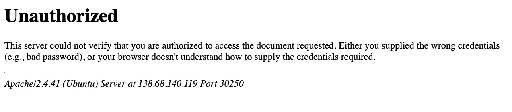
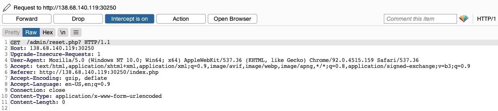
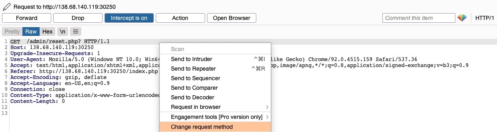
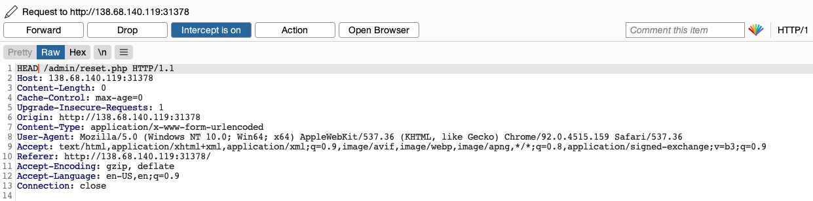

# Ignorando a autenticação básica

Precisamos apenas tentar métodos HTTP alternativos para ver como eles são tratados pelo servidor web e pela aplicação web. Embora muitas ferramentas automatizadas de verificação de vulnerabilidades possam identificar consistentemente vulnerabilidades de adulteração de verbos HTTP causadas por configurações de servidor inseguras, elas geralmente deixam de identificar vulnerabilidades de adulteração de HTTP causadas por codificação insegura. Isso ocorre porque o primeiro tipo pode ser facilmente identificado quando ignoramos uma página de autenticação, enquanto o outro precisa de testes ativos para ver se podemos ignorar os filtros de segurança em vigor.

O primeiro tipo de vulnerabilidade de adulteração de verbo HTTP é causado principalmente por `Insecure Web Server Configurations`, e a exploração dessa vulnerabilidade pode nos permitir ignorar o prompt de autenticação básica HTTP em determinadas páginas.

## Identificar

Ao iniciarmos o exercício no final desta seção, vemos que temos uma aplicação web básica de `File Manager`, na qual podemos adicionar novos arquivos digitando seus nomes e pressionando `enter`:


No entanto, suponha que tentamos excluir todos os arquivos clicando no botão vermelho `Reset`. Nesse caso, vemos que esta funcionalidade parece ser restrita apenas para usuários autenticados, pois recebemos o seguinte prompt `HTTP Basic Auth` :


Como não temos credenciais, obteremos uma página de `401 Unauthorized` :



Então, vamos ver se podemos contornar isso com um ataque de adulteração de verbo HTTP. Para isso, precisamos identificar quais páginas estão restritas por esta autenticação. Se examinarmos a solicitação HTTP após clicar no botão Redefinir ou observarmos a URL para a qual o botão navega após clicar nele, veremos que ela está em `/admin/reset.php`. Portanto, ou o diretório `/admin` está restrito apenas a usuários autenticados ou apenas a página `/admin/reset.php` está. Podemos confirmar isso visitando o diretório `/admin` e, de fato, somos solicitados a fazer login novamente. Isso significa que o diretório `/admin` é restrito.

## Explorar

Para tentar explorar a página, precisamos identificar o método de solicitação HTTP usado pela aplicação web. Podemos interceptar a solicitação no Burp Suite e examiná-la:



Como a página usa uma solicitação `GET`, podemos enviar uma solicitação `POST` e ver se a página da web permite solicitações `POST` (ou seja, se a Autenticação cobre solicitações `POST`). Para fazer isso, podemos clicar com o botão direito na solicitação interceptada no Burp e selecionar `Change Request Method`, e isso automaticamente transformará a solicitação em uma solicitação `POST`.



Feito isso, podemos clicar em `Forward`e examinar a página em nosso navegador. Infelizmente, ainda somos solicitados a fazer login e receberemos uma página de `401 Unauthorized` se não fornecermos as credenciais.


Portanto, parece que as configurações do servidor web cobrem solicitações `GET` e `POST` . No entanto, como aprendemos anteriormente, podemos utilizar muitos outros métodos HTTP, principalmente o método `HEAD`, que é idêntico a um `GET` , mas não retorna o corpo na resposta HTTP. Se isso for bem-sucedido, podemos não receber nenhuma saída, mas a função `reset` ainda deverá ser executada, que é nosso objetivo principal.

Para verificar se o servidor aceita solicitações `HEAD`, podemos enviar uma solicitação `OPTIONS` a ele e ver quais métodos HTTP são aceitos, como segue:

```bash
NycolasES6@htb[/htb]$ curl -i -X OPTIONS http://SERVER_IP:PORT/

HTTP/1.1 200 OK
Date:
Server: Apache/2.4.41 (Ubuntu)
Allow: POST,OPTIONS,HEAD,GET
Content-Length: 0
Content-Type: httpd/unix-directory
```

Como podemos ver, a resposta mostra `Allow: POST,OPTIONS,HEAD,GET`, o que significa que o servidor web realmente aceita solicitações `HEAD`, que é a configuração padrão para muitos servidores web. Então, vamos tentar interceptar a solicitação `reset` novamente e, desta vez, usar uma solicitação `HEAD` para ver como o servidor web a trata:



Assim que mudarmos `POST` e `HEAD` e encaminharmos a solicitação, veremos que não receberemos mais um prompt de login ou uma página `401 Unauthorized` e, em vez disso, obteremos uma saída vazia, como esperado com uma solicitação `HEAD`. Se voltarmos ao aplicativo da web `File Manager`, veremos que todos os arquivos foram realmente excluídos, o que significa que acionamos a funcionalidade `Reset` com sucesso sem ter acesso de administrador ou quaisquer credenciais:


