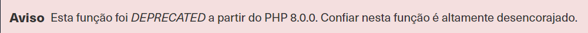

# Prevenção de XXE

Vimos que as vulnerabilidades XXE ocorrem principalmente quando uma entrada XML insegura faz referência a uma entidade externa, que eventualmente é explorada para ler arquivos confidenciais e realizar outras ações. Prevenir vulnerabilidades XXE é relativamente mais fácil do que prevenir outras vulnerabilidades da web, pois elas são causadas principalmente por bibliotecas XML desatualizadas.

## Evitando componentes desatualizados

Embora outras vulnerabilidades da Web de validação de entrada sejam geralmente evitadas por meio de práticas de codificação seguras (por exemplo, XSS, IDOR, SQLi, OS Injection), isso não é totalmente necessário para evitar vulnerabilidades XXE. Isso ocorre porque a entrada XML geralmente não é tratada manualmente pelos desenvolvedores da web, mas sim pelas bibliotecas XML integradas. Portanto, se um aplicativo da web for vulnerável ao XXE, isso provavelmente se deve a uma biblioteca XML desatualizada que analisa os dados XML.

Por exemplo, a função libxml_disable_entity_loader do PHP está obsoleta porque permite que um desenvolvedor habilite entidades externas de maneira insegura, o que leva a vulnerabilidades XXE. Se visitarmos a documentação do PHP para esta função, veremos o seguinte aviso:

Além disso, até mesmo editores de código comuns (por exemplo, VSCode) destacarão que esta função específica está obsoleta e nos alertarão contra seu uso:

> Nota: Você pode encontrar um relatório detalhado de todas as bibliotecas XML vulneráveis, com recomendações sobre como atualizá-las e usar funções seguras, no XXE Prevention Cheat Sheet da OWASP .

Além de atualizar as bibliotecas XML, devemos também atualizar quaisquer componentes que analisam a entrada XML, como bibliotecas API como SOAP. Além disso, quaisquer processadores de documentos ou arquivos que possam realizar análise XML, como processadores de imagens SVG ou processadores de documentos PDF, também podem estar vulneráveis ​​às vulnerabilidades XXE, e devemos atualizá-los também.

Esses problemas não são exclusivos apenas das bibliotecas XML, pois o mesmo se aplica a todos os outros componentes da web (por exemplo, ``Node Modules`` desatualizados). Além dos gerenciadores de pacotes comuns (por exemplo, ``npm``), editores de código comuns notificarão os desenvolvedores web sobre o uso de componentes desatualizados e sugerirão outras alternativas. No final das contas, o uso das bibliotecas XML e componentes de desenvolvimento web mais recentes pode ajudar muito a reduzir várias vulnerabilidades da web, incluindo XXE.

## Usando configurações XML seguras

Além de usar as bibliotecas XML mais recentes, certas configurações XML para aplicativos da web podem ajudar a reduzir a possibilidade de exploração do XXE. Esses incluem:

- Desativar a referência a definições de tipo de documento (DTDs) personalizadas
- Desabilitar a referência a entidades XML externas
- Desativar processamento de entidade de parâmetro
- Desativar suporte para XInclude
- Impedir loops de referência de entidade

Outra coisa que vimos foi a exploração XXE baseada em erros. Portanto, devemos sempre ter um tratamento adequado de exceções em nossas aplicações web e sempre desabilitar a exibição de erros de tempo de execução em servidores web.

Essas configurações devem ser outra camada de proteção caso deixemos de atualizar algumas bibliotecas XML e também devem evitar a exploração do XXE. No entanto, ainda podemos usar bibliotecas vulneráveis nesses casos e apenas aplicar soluções alternativas contra a exploração, o que não é o ideal.

Com os vários problemas e vulnerabilidades introduzidos pelos dados XML, muitos também recomendam o uso de outros formatos, como JSON ou YAML. Isso também inclui evitar padrões de API que dependem de XML (por exemplo, SOAP) e usar APIs baseadas em JSON (por exemplo, REST).

Finalmente, o uso de Web Application Firewalls (WAFs) é outra camada de proteção contra a exploração do XXE. No entanto, nunca devemos confiar inteiramente nos WAFs e deixar o back-end vulnerável, pois os WAFs sempre podem ser contornados.
