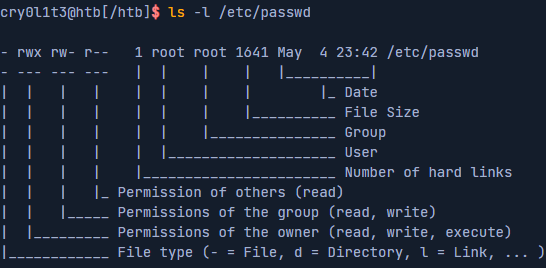
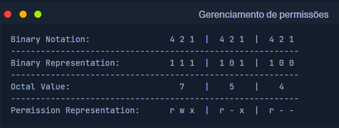
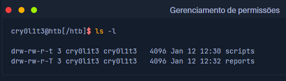

# Gerenciamento de permissões

No linux, as permissões são atribuídas a usuários e grupos. Cada usuário pode ser membro de grupos diferentes, e a associação a esses grupos fornece ao usuário permissões adicionais especifícas. Cada arquivo e diretório pertence a um usuário específico e a um grupo específico. Assim as permissõespara usuários e grupos que definiriam um arquivo também são definidas para os respectivosproprietários. Quando criamos novos arquivos ou diretórios, eles pertencem ao grupo ao qual pertencemos e a nós.

Quando um usuário deseja acessar o conteúdo de um diretório linux, ele deve primeiro percorrer o diretório, o que significa navegar até esse diretório,  exigindo que o usuário tenha permissão de execução no diretório. Sem esta permissão, o usuário não poderá acessar o conteúdo do diretório e, em vez disso, receberá uma mensagem de erro " **Permission Denied**".

É importante observar que na execução são necessárias permissões para percorrer um diretório, independentemente do nível de acesso do usuário. Além disso, as permissões de execução em um diretório não permitem que um usuário execute ou modifique quaisquer arquivos ou conteúdos dentro do diretório, apenas para percorrer e acessar o conteúdo do diretório.

Para executar arquivos dentro do diretório, um usuário precisa de permissões de execução no arquivo correspondente. Para modificar o conteúdo de um diretório (criar, excluir ou renomear arquivos e subdiretórios), o usuário precisa de
permissões de escrita no diretório.

Todo o sistema de permissões em sistemas Linux é baseado no sistema de números octais e, basicamente, existem três tipos diferentes de permissões que podem ser atribuídas a um arquivo ou diretório:

 - ( **r** ) - Ler
 - ( **w** ) - Escrever
 - ( **x** ) - Executar

As permissões podem ser definidas para **owner**, **group** e **others** como apresentado no próximo exemplo com suas permissões correspondentes.

## Alterar permissões

Podemos modificar as permissões usando o comando `chmod`, referências de grupo de permissões ( **u**- proprietário, **g**- Grupo, **o**- outros, **a**- Todos os usuários) e um [ **+**] ou um [ **-**] para adicionar e remover as permissões designadas. No exemplo a seguir, um usuário cria um novo script de shell de propriedade desse usuário, não executável, e definido com permissões de leitura/gravação para todos os usuários.

`ls -l shell`

Podemos então aplicar permissão de leitura para todos os usuários e ver o resultado.

`chmod a+r shell && ls -l shell`

Também podemos definir as permissões de letura para todos os outros usuários usando apenas a tribuição de valor octal.

`chmod 754 shell && ls -l shell`

Vejamos todas as representações a ele para entender melhor como a atribuição de permissão é calculada.

Se somarmos os bits definidos Binary Representation atribuidos aos valores Binary Notation juntos, obteremos o Octal Value. O Permission Representation representa os bits definidos no Binary Representation usando os três caracteres, o que apenas reconhece as permissões definidas com mais facilidade.

## Alterar proprietário

Para alterar o proprietário e/ou as atribuições de grupo de um arquivo ou diretório, podemos usar o comando chown. A sintaxe é a seguinte:

### Sintaxe - chown

`chown <user>:<group> <file/directory>`

Neste exemplo, "shell" pode ser substituído por qualquer arquivo ou pasta arbitrária.

`chown root:root shell && ls -l shell`

## SUID e SGID

Além de atribuir permissões diretas a usuários e grupos, também podemos configurar permissões especiais para arquivos definindo os bits Set User ID(SUID) e Set Group ID(SGID). Esses bits SUID/SGID permitem, por exemplo, que usuários executem programas com os direitos de outro usuário. Os administradores costumam usar isso para conceder aos usuários direitos especiais para determinados arquivos ou aplicaivos. A ltera "s" é usada em vez de "x". Ao executar tal programa, o SUID/SGID do proprietário do arquivo é usado.

Muitas vezes acontece que os administradores não estão familiarizados com os aplicativos, mas ainda assim atribuem os bits SUID/SGID, o que leva a um alto risco de segurança. Tais programas podem conter funções que permitem a execução de um shell a partir do pger, como a aplicação"journalctl".

Se o admistrador definir o bit SUID como "journalctl", qualquer usuário com acesso a este aplicativo poderá executar um shell como root. Mais informações sobre este e outros aplicativos podem ser encontradas em GTFObins.

## Pedaço pegajoso

Sticky bits são um tipo de permissão de arquivo no linux que pode ser definida em diretórios. Este tipo de permissão fornece uma camada extra de segurança ao controlar a exclusão e a renomeação de um marquivo dentro de um diretório. Geralmente é usado em diretórios compartilhados por vários usuários para evitar que um usuário exclua ou renomeie acidentalmente arquivoa que são importantes para outros.

Por exemplo, em um diretório inicial compartilhado, onde vários usuários têm acesso ao mesmo diretório, um administrador do sistema pode definir o sticky bit no diretório para garantir que apenas o proprietário do arquivo, o proprietário do diretório ou o usuário root pode excluir ou renomear arquivos dentro do diretório. Isso significa que outros usuários não podem excluir ou renomear arquivos no diretório porque não possuem as permissões necessárias. Isso fornece uma camada adicional de segurança para proteger arquivos importantes, pois somente aqueles com o acesso necessário podem excluir ou renomear arquivos. Definir o sticky bit em um diretório garante que apenas o proprietário, o proprietário do diretório ou o usuário root possam alterar os arquivos dentro do diretório.

Quando um sticky bit é definido em um diretório, ele é representado pela letra "t" na permissão de execução das permissões do diretório. Por exemplo, se um diretório tiver permissões "rwxrwxrwt", significa que o sticky bit está definido, dando o extra nível de segurança para que ninguém além do proprietário ou usuário root possa excluir ou renomear os arquivos ou pastas no diretório.

Neste exemplo, vemos que ambos os diretórios têm o sticky bit definido. No entanto, a pasta reports tem letras T maiúsculas e a script tem letras t minúsculas.

Se o sticky bit estiver maiúsculo, isso significa que todos os outros usuários não têm permissões de execução e, portanto, não podem ver o conteúdo da pasta nem executar nenhum programa a partir dela. O scticky bit minúsculo é o bit sticky onde as permissões de execução foram definidas.

