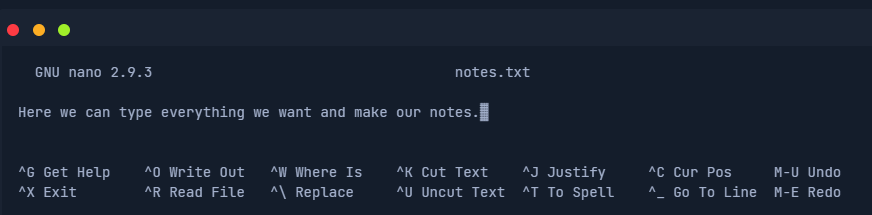
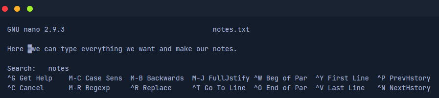
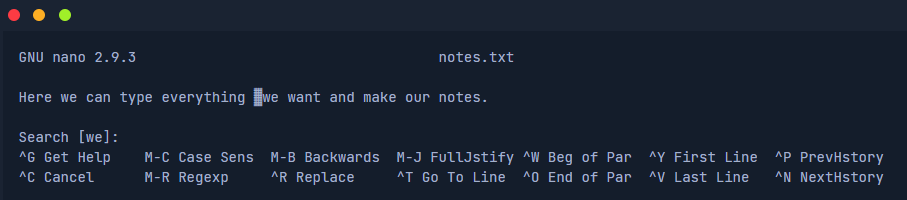
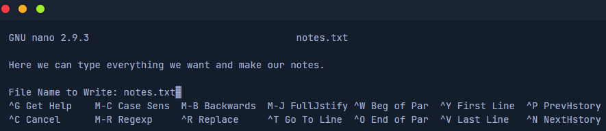
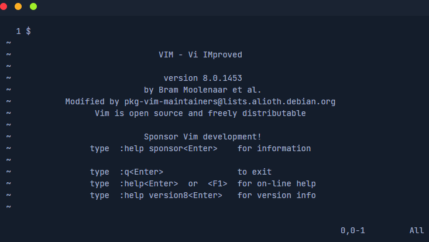
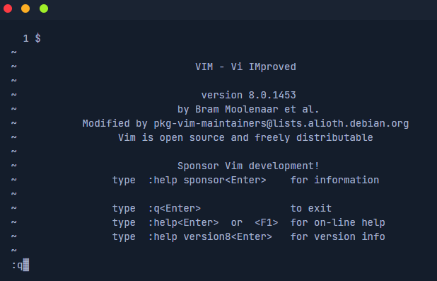

# Editando arquivos

Um dos editores de texto mais comuns para isso é ``Vi`` e o ``Vim``. Mais raramente, existe o editor ``Nano``. Trataremos primeiro do editor ``Nano`` aqui, pois é um pouco mais fácil de entender. Podemos criar um novo arquivo diretamente com o editor ``Nano``, especificando o nome do arquivo diretamente como o primeiro parâmetro. Neste caso, criamos um novo arquivo chamado ``notes.txt``.

`NycolasES6@htb[/htb]$ nano notes.txt`

Agora devemos ver o chamado " pager" aberto e podemos inserir ou inserir livremente qualquer texto. Nosso shell deve então ficar parecido com isto.

## Editor Nano

Abaixo vemos duas linhas com breves descrições. O caracter **( ^ )** representa nossa chave **[CTRL]**. Por exemplo, se pressionarmos **[CTRL + W]**, aparece uma linha " **Search:**" na parte inferior do editor, onde podemos inserir a palavra ou palavras que procuramos. Se procurarmos agora a palavra " **we** " e pressionarmos **[ENTER]**, o cursor se moverá para a primeira palavra que corresponder.

Para pular para a próxima partida com o cursor, pressionamos **[CTRL + W]** novamente e confirmamos **[ENTER]** sem nenhuma informação adicional.

Agora podemos salvar o arquivo pressionando **[CTRL + O]** e confirmando o nome do arquivo com **[ENTER]**.

Depois de salvar o arquivo, podemos sair do editor com a extensão **[CTRL + X]**.

## SHELL

Para visualizar o conteúdo do arquivo, podemos usar o comando ``cat``.

Existem muitos arquivos em sistemas Linux que podem desempenhar um papel essencial para nós, como testadores de penetração, cujos direitos não foram definidos corretamente pelos administradores. Esses arquivos podem incluir o arquivo " ``/etc/passwd`` ".

## VIM

``Vim`` é um editor de código aberto para todos os tipos de texto ASCII, assim como o Nano. É um clone melhorado do Vi anterior. É um editor extremamente poderoso que se concentra no essencial, nomeadamente na edição de texto. Para tarefas que vão além disso, o Vim fornece uma interface para programas externos, como grep, awk, sed, etc., que podem lidar com suas tarefas específicas muito melhor do que uma função correspondente implementada diretamente em um editor normalmente consegue. Isso torna o editor pequeno e compacto, rápido, poderoso, flexível e menos sujeito a erros.

O Vim segue aqui o princípio Unix: muitos pequenos programas especializados que são bem testados e comprovados, quando combinados e se comunicando entre si, resultando em um sistema flexível e poderoso.

``NycolasES6@htb[/htb]$ vim``

Em contraste com o **Nano**, **Vim** é um editor modal que pode distinguir entre entrada de texto e comando. O Vim oferece um total de seis modos fundamentais que facilitam nosso trabalho e tornam este editor tão poderoso :

``Normal`` - No modo normal, todas as entradas são consideradas comandos do editor. Portanto não há inserção dos caracteres inseridos no buffer do editor, como acontece com a maioria dos outros editores. Depois de iniciar o editor, geralmente estamos no modo normal.

``Insert`` - Com algumas exceções, todos os caracteres inseridos são inseridos no buffer.

``Visual`` - O modo visual é utilizado para marcar uma parte contígua do texto, que será destacada visualmente. Ao posicionar o cursor, alteramos a área selecionada. A área destacada pode então ser editada de várias maneiras, como exclusão, cópia ou substituição.

``Command`` - Ele nos permite inserir comandos de linha única na parte inferior do editor. Isso pode ser usado para classificar, substituir seções de texto ou excluí-las, por exemplo.
Replace	No modo de substituição, o texto recém-inserido substituirá os caracteres de texto existentes, a menos que não haja mais caracteres antigos na posição atual do cursor. Em seguida, o texto recém-inserido será adicionado.

Quando tivermos o editor Vim aberto, podemos entrar no modo de comando digitando " ``:`` " e depois digitando " ``q`` " para fechar o Vim.

## VIM tutor

O Vim oferece uma excelente oportunidade para **vimtutor** praticar e se familiarizar com o editor. Pode parecer muito difícil e complicado no início, mas só será assim por um curto período de tempo. A eficiência que ganhamos com o Vim quando nos acostumamos é enorme. Entrar no modo **tutor** pode ser feito usando o modo de comando **:Tutor**.

``NycolasES6@htb[/htb]$ vimtutor``
