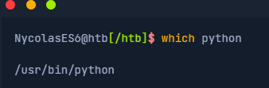
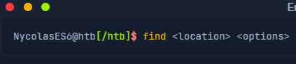
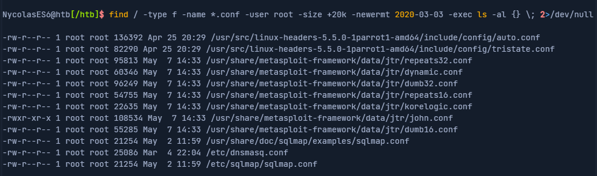

# Procurando arquivos e diretórios

## Which

Uma das ferramentas comuns é **which**. Esta ferramenta retorna o caminho do arquivo ou link que deve ser executado. Isso nos permite determinar se programas específicos, como cURL , netcat , wget , python , gcc , estão disponíveis no sistema operacional. Vamos usá-lo para procurar Python em nossa instância interativa.

## find

Outra ferramenta útil é **find**. Além da função de localizar arquivos e pastas, esta ferramenta também contém a função de filtrar os resultados. Podemos usar parâmetros de filtro como o tamanho do arquivo ou a data. Também podemos especificar se procuramos apenas arquivos ou pastas.

Sintáxe

Vejamos um exemplo de como seria um comando com múltiplas opções.

``-type f`` - Assim, definimos o tipo do objeto pesquisado. Neste caso, '``f``' significa ' file'.

``-name *.conf`` - Com '``-name``', indicamos o nome do arquivo que procuramos. O asterisco (*) significa 'todos' os arquivos com a .confextensão ''.

``-user root`` - Esta opção filtra todos os arquivos cujo proprietário é o usuário root.

``-size +20k`` - Podemos então filtrar todos os arquivos localizados e especificar que queremos ver apenas os arquivos maiores que 20 KiB.

``-newermt 2020-03-03`` - Com esta opção, definimos a data. Somente arquivos mais recentes que a data especificada serão apresentados.

``-exec ls -al {} \;`` - Esta opção executa o comando especificado, usando chaves como espaços reservados para cada resultado. A barra invertida evita que o próximo caractere seja interpretado pelo shell porque, caso contrário, o ponto e vírgula encerraria o comando e não alcançaria o redirecionamento.

``2>/dev/null`` - Este é um STDERRredirecionamento para o ' null device', ao qual voltaremos na próxima seção. Este redirecionamento garante que nenhum erro seja exibido no terminal. Este redirecionamento deve notser uma opção do comando ‘find’.

## Locate

Levará muito tempo para pesquisar nossos arquivos e diretórios em todo o sistema para realizar muitas pesquisas diferentes. O comando **locate** nos oferece uma maneira mais rápida de pesquisar no sistema. Ao contrário do **find**, **locate** funciona com um banco de dados local que contém todas as informações sobre arquivos e pastas existentes. Podemos atualizar este banco de dados com o seguinte comando.

``NycolasES6@htb[/htb]$ sudo updatedb``

Se agora pesquisarmos todos os arquivos com a extensão **.conf**, você descobrirá que essa pesquisa produz resultados muito mais rápidos do que usar **find**.

``NycolasES6@htb[/htb]$ locate *.conf``

